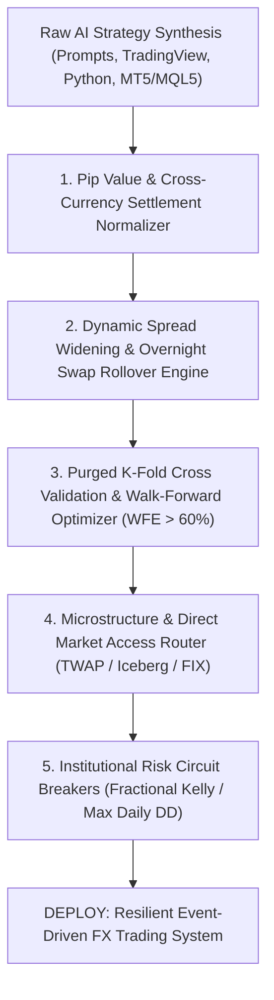

# VIBE CODER'S FOREIGN EXCHANGE (FOREX) & CURRENCY TRADING CANON
## The 50 Authoritative Books on Market Microstructure, ECN Order Flow, Algorithmic Execution, Quantitative Carry, Machine Learning in Finance, Risk Mathematics, and Macroeconomic Regimes

> In the **$7.5-trillion-per-day Foreign Exchange (Forex) market**, there is no centralized clearinghouse or single exchange.
> Currency trading is an asymmetric, decentralized over-the-counter (OTC) battlefield governed by interbank tier-1 dealers,
> electronic communication networks (ECNs), high-frequency liquidity providers, and sovereign central banks.
>
> When a **vibe code developer** leverages AI models (LLMs, coding agents, rapid prompts) to build automated Forex bots,
> execution routers, and quantitative models, the uncurated output routinely defaults to **Catastrophic Account Blowup**:
> - Zero accounting for dynamic spread widening (3x-10x spikes during the 5:00 PM NY rollover).
> - Fatal pip value calculation errors across cross-currency pairs (misidentifying quote currency conversion legs).
> - Severe lookahead bias and serial correlation leakage in backtests (using random splits instead of purged cross-validation).
> - Overfitted technical indicators that lack statistical significance after correcting for multiple testing.
> - Assuming infinite market depth and zero slippage on stop-loss market orders during high-impact news events (NFP, CPI, rate decisions).
>
> This canon details the **50 foundational texts** that equip the vibe code developer with the mathematical rigor,
> architectural invariants, and institutional safeguards necessary to build 100% reliable, production-grade automated currency systems.

---

## Pillar I: FX Market Microstructure, Order Flow & Interbank Mechanics

### #1. The Microstructure Approach to Exchange Rates
- **Author(s)**: Richard K. Lyons
- **Publisher / Edition**: MIT Press (2001)
- **ISBN-10**: `0262122421` | **ISBN-13**: `978-0262122429`
- **Core Premise**: Models foreign exchange price formation via order flow dynamics, dealer inventory management, and asymmetric private information rather than purely macroeconomic aggregates.
- **The Vibe Coder's Edge**: Essential for modeling dealer quote-shading, interpreting institutional customer order flow imbalances, and avoiding naive assumptions that order books have infinite depth.

### #2. Foreign Exchange: A Practical Guide to the FX Markets
- **Author(s)**: Tim Weithers
- **Publisher / Edition**: John Wiley & Sons (2006)
- **ISBN-10**: `0471732036` | **ISBN-13**: `978-0471732037`
- **Core Premise**: Complete pedagogical walkthrough of currency pair quotation conventions (base vs. terms), triangular cross-rates, forward points, and interest rate parity.
- **The Vibe Coder's Edge**: Eliminates foundational logic errors in vibe-coded trade settlement engines, such as inverted bid/ask spreads on crosses or miscalculated pip decimal shifts.

### #3. Day Trading and Swing Trading the Currency Market
- **Author(s)**: Kathy Lien
- **Publisher / Edition**: John Wiley & Sons (2015 (3rd Edition))
- **ISBN-10**: `1119108411` | **ISBN-13**: `978-1119108412`
- **Core Premise**: Practical market drivers, currency personality traits (safe havens vs. high-beta commodity currencies), and macro economic news release reaction patterns (NFP, CPI, rate cuts).
- **The Vibe Coder's Edge**: Provides rule-based inputs for event-driven filters, preventing automated bots from executing market orders during spread blowouts around central bank announcements.

### #4. Currency Forecasting: A Guide to Fundamental and Technical Models of Exchange Rate Determination
- **Author(s)**: Michael R. Rosenberg
- **Publisher / Edition**: McGraw-Hill (1996)
- **ISBN-10**: `1557389187` | **ISBN-13**: `978-1557389183`
- **Core Premise**: Institutional reference on macroeconomic models: Purchasing Power Parity (PPP), Uncovered Interest Parity (UIP), monetary models, and current account balances.
- **The Vibe Coder's Edge**: Gives vibe coders the exact equations needed to engineer long-horizon macro features and mean-reversion fair-value anchors.

### #5. The Foreign Exchange Matrix: A New Framework for Understanding Currency Movements
- **Author(s)**: Barbara Rockefeller, Vicki Schmelzer
- **Publisher / Edition**: Harriman House (2013)
- **ISBN-10**: `0857191306` | **ISBN-13**: `978-0857191304`
- **Core Premise**: Multi-currency flow matrix analysis, capital flows, reserve manager behavior, sovereign wealth funds, and cross-asset correlations (equities, yields, commodities).
- **The Vibe Coder's Edge**: Guides the design of real-time currency strength meters and multi-pair covariance matrices, preventing strategies from loading duplicate risk on correlated USD legs.

### #6. Inside the Currency Market: Mechanics and Strategies for Success
- **Author(s)**: Brian Dolan
- **Publisher / Edition**: Bloomberg Press / John Wiley & Sons (2011)
- **ISBN-10**: `1576603784` | **ISBN-13**: `978-1576603789`
- **Core Premise**: Operational structure of electronic communications networks (ECNs), prime brokerages, liquidity aggregation pools, and the London/New York session overlap.
- **The Vibe Coder's Edge**: Teaches developers how to model realistic slippage, liquidity drops during the Asian session, and post-5 PM NY rollover bank clearing throttles.

### #7. Exchange Rate Economics: Theories and Evidence
- **Author(s)**: Ronald MacDonald
- **Publisher / Edition**: Routledge (2007)
- **ISBN-10**: `0415125510` | **ISBN-13**: `978-0415125512`
- **Core Premise**: Empirical econometrics of exchange rates, testing random walk hypotheses, co-integration of exchange rates, and structural regime switching.
- **The Vibe Coder's Edge**: Crucial for auditing econometric claims generated by LLMs; warns against asserting cointegration without proper Dickey-Fuller and Johansen cointegration test gates.

### #8. The Economics of Exchange Rates
- **Author(s)**: Lucio Sarno, Mark P. Taylor
- **Publisher / Edition**: Cambridge University Press (2002)
- **ISBN-10**: `0521485843` | **ISBN-13**: `978-0521485845`
- **Core Premise**: Examines non-linearities in exchange rate dynamics, target zone models, official foreign exchange intervention effectiveness, and forward premium bias anomalies.
- **The Vibe Coder's Edge**: Equips developers with mathematical formulation of the forward discount puzzle, the theoretical backbone of quantitative carry trade models.

## Pillar II: Algorithmic Architecture, System Engineering & Direct Market Access

### #9. Building Algorithmic Trading Systems: A Trader's Journey from Data Mining to Monte Carlo Simulation to Live Trading
- **Author(s)**: Kevin J. Davey
- **Publisher / Edition**: John Wiley & Sons (2014)
- **ISBN-10**: `1118778987` | **ISBN-13**: `978-1118778982`
- **Core Premise**: Disciplined manufacturing process for algorithmic trading: in-sample data mining, walk-forward testing, Monte Carlo risk simulation, and automated deployment.
- **The Vibe Coder's Edge**: The ideal step-by-step system prompt template for instructing AI coding agents on how to build and validate trading bots without human self-delusion.

### #10. Quantitative Trading: How to Build Your Own Algorithmic Trading Business
- **Author(s)**: Ernest P. Chan
- **Publisher / Edition**: John Wiley & Sons (2021 (2nd Edition))
- **ISBN-10**: `1119800064` | **ISBN-13**: `978-1119800064`
- **Core Premise**: Foundational guide for independent quantitative developers: backtest pitfalls, data sanitization, transaction cost models, and retail API execution architectures.
- **The Vibe Coder's Edge**: Mandatory reading to avoid the top vibe-coding trap: backtests that show a 5.0 Sharpe ratio purely because bid-ask spread and financing costs were omitted.

### #11. Algorithmic Trading: Winning Strategies and Their Rationale
- **Author(s)**: Ernest P. Chan
- **Publisher / Edition**: John Wiley & Sons (2013)
- **ISBN-10**: `1118460146` | **ISBN-13**: `978-1118460146`
- **Core Premise**: Rigorous treatment of statistical arbitrage, mean reversion, momentum, and cross-currency cointegration with exact mathematical formulas and pseudocode.
- **The Vibe Coder's Edge**: Provides drop-in algorithmic recipes (ADF test, Johansen test, Ornstein-Uhlenbeck half-life formula) that can be verified deterministically.

### #12. Systematic Trading: A Unique New Method for Designing Trading and Investing Systems
- **Author(s)**: Robert Carver
- **Publisher / Edition**: Harriman House (2015)
- **ISBN-10**: `0857194453` | **ISBN-13**: `978-0857194459`
- **Core Premise**: Framework for systematic continuous position sizing, forecast scaling, volatility targeting, and multi-asset capital allocation without subjective intervention.
- **The Vibe Coder's Edge**: Eliminates binary on/off trading logic; enables vibe coders to prompt smooth position sizing scaled inversely to prevailing ATR (Average True Range).

### #13. Python for Algorithmic Trading: From Idea to Cloud Deployment
- **Author(s)**: Yves Hilpisch
- **Publisher / Edition**: O'Reilly Media (2020)
- **ISBN-10**: `149205335X` | **ISBN-13**: `978-1492053354`
- **Core Premise**: Full engineering stack for Python automated trading: vectorized backtesting, event-driven socket pipelines, real-time tick processing, and cloud deployment.
- **The Vibe Coder's Edge**: Directly usable patterns for structuring asyncio event loops, WebSocket connections to OANDA/Interactive Brokers, and automated cloud monitoring.

### #14. Trading and Exchanges: Market Microstructure for Practitioners
- **Author(s)**: Larry Harris
- **Publisher / Edition**: Oxford University Press (2002)
- **ISBN-10**: `0195144708` | **ISBN-13**: `978-0195144703`
- **Core Premise**: The comprehensive bible on market structure: order types, limit order books, bid-ask spreads, market makers, dealer inventory, and adverse selection.
- **The Vibe Coder's Edge**: Gives developers the domain vocabulary and invariants to model order queues, fill probabilities, and toxic order flow.

### #15. Algorithmic and High-Frequency Trading
- **Author(s)**: Álvaro Cartea, Sebastian Jaimungal, José Penalva
- **Publisher / Edition**: Cambridge University Press (2015)
- **ISBN-10**: `1107091144` | **ISBN-13**: `978-1107091146`
- **Core Premise**: Stochastic optimal control, Hawkes processes for jump arrivals, Almgren-Chriss optimal liquidation, and limit order placement strategies.
- **The Vibe Coder's Edge**: High-level mathematical foundation for writing optimal trade execution algorithms that minimize market impact when managing large currency orders.

### #16. Developing High-Frequency Trading Systems
- **Author(s)**: Sebastien Donadio, Sourav Ghosh
- **Publisher / Edition**: Packt Publishing (2017)
- **ISBN-10**: `1788296311` | **ISBN-13**: `978-1788296311`
- **Core Premise**: Low-latency systems engineering: cache-friendly memory structures, lock-free ring buffers, socket optimization, and FIX protocol integration.
- **The Vibe Coder's Edge**: Critical for vibe coders transitioning from slow REST polling loops to zero-copy, sub-millisecond execution pipelines in C++ or Rust.

### #17. Algorithmic Trading & DMA: An Introduction to Direct Access Trading Strategies
- **Author(s)**: Barry Johnson
- **Publisher / Edition**: 4Myeloma Press (2010)
- **ISBN-10**: `0956399207` | **ISBN-13**: `978-0956399205`
- **Core Premise**: Encyclopedia of institutional trading execution algorithms (TWAP, VWAP, Implementation Shortfall, Volume Inline, and Iceberg detection).
- **The Vibe Coder's Edge**: Blueprint for implementing institutional-grade algorithmic order slicers that protect retail accounts from being front-run by institutional liquidity providers.

## Pillar III: Quantitative Strategies, Statistical Arbitrage & Technical Rigor

### #18. Pairs Trading: Quantitative Methods and Analysis
- **Author(s)**: Ganapathy Vidyamurthy
- **Publisher / Edition**: John Wiley & Sons (2004)
- **ISBN-10**: `0471460672` | **ISBN-13**: `978-0471460671`
- **Core Premise**: Time-series cointegration testing, error-correction models (ECM), and Kalman filtering applied to pairs trading and spread arbitrage.
- **The Vibe Coder's Edge**: Provides the mathematical groundwork to code robust triangular arbitrage and cross-currency cointegration bots (e.g., EUR/USD vs. GBP/USD vs. EUR/GBP).

### #19. Statistically Sound Indicators for Financial Market Prediction
- **Author(s)**: Timothy Masters
- **Publisher / Edition**: CreateSpace (2019)
- **ISBN-10**: `1099682126` | **ISBN-13**: `978-1099682124`
- **Core Premise**: Stationary time-series transformation, non-linear indicator derivation, entropy metrics, and data normalization for predictive model inputs.
- **The Vibe Coder's Edge**: Prevents feeding raw non-stationary price data into neural networks, ensuring inputs have zero lookahead bias and stable statistical distributions.

### #20. Evidence-Based Technical Analysis: Applying the Scientific Method and Statistical Inference to Trading Signals
- **Author(s)**: David Aronson
- **Publisher / Edition**: John Wiley & Sons (2006)
- **ISBN-10**: `0470008741` | **ISBN-13**: `978-0470008744`
- **Core Premise**: Statistical hypothesis testing, Monte Carlo permutation tests, and data-mining bias corrections (White's Reality Check) for evaluating technical rules.
- **The Vibe Coder's Edge**: The ultimate antidote to chart pattern hallucination: proves why 95% of retail technical indicators lack statistical significance when corrected for multiple testing.

### #21. Quantitative Momentum: A Practitioner's Guide to Building a Momentum-Based Stock/Asset Selection System
- **Author(s)**: Wesley R. Gray, Jack R. Vogel
- **Publisher / Edition**: John Wiley & Sons (2016)
- **ISBN-10**: `111923719X` | **ISBN-13**: `978-1119237198`
- **Core Premise**: Behavioral foundations of momentum, path quality (smooth vs. erratic trends), and time-series momentum scaling.
- **The Vibe Coder's Edge**: Enables vibe coders to prompt momentum strategies that filter out choppy, high-volatility false breakouts in major currency pairs.

### #22. Finding Alphas: A Quantitative Approach to Building Trading Strategies
- **Author(s)**: Igor Tulchinsky
- **Publisher / Edition**: John Wiley & Sons (2019 (2nd Edition))
- **ISBN-10**: `1119565200` | **ISBN-13**: `978-1119565208`
- **Core Premise**: WorldQuant's methodology for engineering, backtesting, and combining hundreds of uncorrelated mathematical alpha expressions into robust portfolios.
- **The Vibe Coder's Edge**: Provides a syntax and grammar for formulaic alphas that LLMs can rapidly synthesize, test, and cross-correlate.

### #23. Quantitative Trading Systems: Practical Methods for Design, Testing, and Validation
- **Author(s)**: Howard B. Bandy
- **Publisher / Edition**: Blue Owl Press (2007)
- **ISBN-10**: `0979177006` | **ISBN-13**: `978-0979177002`
- **Core Premise**: Design philosophy emphasizing objective functions, fitness metric selection, walk-forward testing, and distribution-based risk accounting.
- **The Vibe Coder's Edge**: Helps developers define loss functions that penalize maximum drawdown duration and downside semi-variance rather than raw profit.

### #24. Mean Reversion Trading Systems: Practical Methods for Swing Trading
- **Author(s)**: Howard B. Bandy
- **Publisher / Edition**: Blue Owl Press (2013)
- **ISBN-10**: `0979177073` | **ISBN-13**: `978-0979177071`
- **Core Premise**: Mathematical modeling of mean-reverting price swings, dynamic band calculation, volatility thresholding, and profit-target optimization.
- **The Vibe Coder's Edge**: Ideal for designing Asian-session range-trading bots and intraday mean-reverting algorithms on non-trending currency crosses like EUR/CHF.

### #25. Following the Trend: Diversified Managed Futures Trading
- **Author(s)**: Andreas F. Clenow
- **Publisher / Edition**: John Wiley & Sons (2012)
- **ISBN-10**: `1118410858` | **ISBN-13**: `978-1118410851`
- **Core Premise**: Deconstructs hedge fund trend-following strategies: multi-asset breakout filters, ATR-based volatility equalization, and long-term trend survival.
- **The Vibe Coder's Edge**: Provides exact, non-curve-fitted rules for systematic multi-currency trend following that have survived live institutional trading across decades.

## Pillar IV: Machine Learning, Deep Learning & Modern AI in Finance

### #26. Advances in Financial Machine Learning
- **Author(s)**: Marcos López de Prado
- **Publisher / Edition**: John Wiley & Sons (2018)
- **ISBN-10**: `1119482089` | **ISBN-13**: `978-1119482086`
- **Core Premise**: The seminal text establishing modern financial ML: Triple Barrier Method, Purged/Embargoed K-Fold cross-validation, fractional differentiation, and meta-labeling.
- **The Vibe Coder's Edge**: The single most important book for AI coders in finance. Fixes the fundamental failure modes of naive ML (data leakage, serial correlation, and unrealistic sample labeling).

### #27. Machine Learning for Asset Managers
- **Author(s)**: Marcos López de Prado
- **Publisher / Edition**: Cambridge University Press (2020)
- **ISBN-10**: `1108792898` | **ISBN-13**: `978-1108792899`
- **Core Premise**: Denoising and detoning empirical covariance matrices with Random Matrix Theory (RMT), clustered feature importance, and Hierarchical Risk Parity (HRP).
- **The Vibe Coder's Edge**: Provides drop-in algorithms for allocating capital across multiple currency pairs without suffering the instability of classical Markowitz mean-variance optimization.

### #28. Machine Learning for Algorithmic Trading
- **Author(s)**: Stefan Jansen
- **Publisher / Edition**: Packt Publishing (2020 (2nd Edition))
- **ISBN-10**: `1839217715` | **ISBN-13**: `978-1839217715`
- **Core Premise**: End-to-end guide to ML in trading: feature engineering from market data, tree-based models (LightGBM/XGBoost), NLP sentiment analysis, and reinforcement learning.
- **The Vibe Coder's Edge**: Provides practical Python pipeline architectures for ingesting tick data, computing technical alphas, and training predictive models.

### #29. Financial Machine Learning: Predicting Prices and Risk with Python
- **Author(s)**: Matthew F. Dixon, Igor Halperin, Paul Bilokon
- **Publisher / Edition**: Springer (2020)
- **ISBN-10**: `3030410676` | **ISBN-13**: `978-3030410674`
- **Core Premise**: Deep probabilistic modeling, autoencoders, neural jump ODEs, and deep reinforcement learning applied to pricing, market making, and risk forecasting.
- **The Vibe Coder's Edge**: Essential for structuring deep neural architectures that respect physical financial constraints rather than treating price series like generic image or text tokens.

### #30. Deep Learning for Finance: Creating Machine Learning Models and Neural Networks for Trading and Forecasting
- **Author(s)**: Sofien Kaabar
- **Publisher / Edition**: O'Reilly Media (2024)
- **ISBN-10**: `1098148479` | **ISBN-13**: `978-1098148478`
- **Core Premise**: Practical application of CNNs, LSTMs, GRUs, and Transformer architectures to financial time-series forecasting, pattern recognition, and regime classification.
- **The Vibe Coder's Edge**: Offers practical PyTorch/TensorFlow recipes tailored specifically to tabular currency data, avoiding excessive latency during live inference.

### #31. Reinforcement Learning for Finance: Solve Problems in Finance with Modern RL Techniques
- **Author(s)**: Bence Tóth
- **Publisher / Edition**: Packt Publishing (2024)
- **ISBN-10**: `1804618799` | **ISBN-13**: `978-1804618790`
- **Core Premise**: Q-learning, Actor-Critic (PPO, DDPG), and model-based RL applied to trade execution, portfolio balancing, and automated market making.
- **The Vibe Coder's Edge**: Guides the creation of realistic Gymnasium-compatible simulated FX environments with fees and slippage to train robust RL execution agents.

### #32. Hands-On Machine Learning for Algorithmic Trading
- **Author(s)**: Stefan Jansen
- **Publisher / Edition**: Packt Publishing (2018)
- **ISBN-10**: `178934641X` | **ISBN-13**: `978-1789346411`
- **Core Premise**: Building ML pipelines, feature extraction from limit order books, Bayesian optimization for hyperparameters, and performance attribution.
- **The Vibe Coder's Edge**: Provides step-by-step guidance on setting up backtest harnesses with Zipline/PyFolio for measuring alpha factor decay.

### #33. Artificial Intelligence in Finance: A Python-Based Guide
- **Author(s)**: Yves Hilpisch
- **Publisher / Edition**: O'Reilly Media (2020)
- **ISBN-10**: `1492055182` | **ISBN-13**: `978-1492055181`
- **Core Premise**: Philosophical and mathematical exploration of AI and deep neural networks in finance, contrasting classical normative theory with data-driven empirical models.
- **The Vibe Coder's Edge**: Helps developers understand why AI models often overfit financial data and how to formulate simple, robust network architectures.

## Pillar V: Order Book Dynamics, Microstructure & High-Frequency Execution

### #34. Trades, Quotes and Prices: Financial Markets Under the Microscope
- **Author(s)**: Jean-Philippe Bouchaud, Julius Bonart, Jonathan Donier, Martin Gould
- **Publisher / Edition**: Cambridge University Press (2018)
- **ISBN-10**: `1107164036` | **ISBN-13**: `978-1107164031`
- **Core Premise**: Statistical physics approach to market microstructure: square-root law of market impact, order flow auto-correlation, and liquidity crisis dynamics.
- **The Vibe Coder's Edge**: Crucial for accurately modeling execution slippage: proves that market impact is non-linear and sub-linear ($I \sim \sigma \sqrt{Q/V}$).

### #35. Empirical Market Microstructure: The Institutions, Economics, and Econometrics of Securities Trading
- **Author(s)**: Joel Hasbrouck
- **Publisher / Edition**: Oxford University Press (2007)
- **ISBN-10**: `0195301641` | **ISBN-13**: `978-0195301649`
- **Core Premise**: Econometric models for order books: Vector Autoregressions (VAR) of trade prices and order flows, Roll's model of effective spread, and price discovery metrics.
- **The Vibe Coder's Edge**: Provides quantitative methods for decomposing FX spreads into liquidity-provider inventory holding costs versus adverse selection from informed traders.

### #36. High-Frequency Trading: A Practical Guide to Algorithmic Strategies and Trading Systems
- **Author(s)**: Irene Aldridge
- **Publisher / Edition**: John Wiley & Sons (2013 (2nd Edition))
- **ISBN-10**: `1118343808` | **ISBN-13**: `978-1118343807`
- **Core Premise**: Covers high-frequency market making, cross-venue latency arbitrage, order book imbalance indicators, and real-time risk controls.
- **The Vibe Coder's Edge**: Essential for coding order book imbalance (OBI) features and designing low-latency hedging bots across fragmented currency liquidity venues.

### #37. Market Microstructure in Practice
- **Author(s)**: Charles-Albert Lehalle, Sophie Laruelle
- **Publisher / Edition**: World Scientific Publishing (2018 (2nd Edition))
- **ISBN-10**: `9813230835` | **ISBN-13**: `978-9813230835`
- **Core Premise**: Practitioner perspective on transaction cost analysis (TCA), algorithmic order routing, dark liquidity pools, and queue position dynamics.
- **The Vibe Coder's Edge**: Teaches developers how institutional FX smart order routers (SORs) divide and execute parent orders to prevent aggressive price leakage.

### #38. Flash Boys: A Wall Street Revolt
- **Author(s)**: Michael Lewis
- **Publisher / Edition**: W. W. Norton & Company (2014)
- **ISBN-10**: `0393244660` | **ISBN-13**: `978-0393244663`
- **Core Premise**: Investigative chronicle of high-frequency trading, microwave networks, co-location, sip latency arbitrage, and predatory front-running.
- **The Vibe Coder's Edge**: Instills deep architectural paranoia: reminds vibe coders that retail orders placed through B-book brokers are vulnerable to synthetic latency delays and asymmetric slip.

### #39. Dark Pools and High Frequency Trading For Dummies
- **Author(s)**: Jay Vaananen
- **Publisher / Edition**: John Wiley & Sons (2015)
- **ISBN-10**: `1119001374` | **ISBN-13**: `978-1119001379`
- **Core Premise**: Clear, accessible breakdown of internalizers, dark liquidity matching, payment for order flow (PFOF), and retail broker B-booking.
- **The Vibe Coder's Edge**: Clarifies the difference between true interbank ECN/STP execution and retail market-maker B-book routing, preventing flawed execution assumptions.

## Pillar VI: Backtesting, Walk-Forward Validation & Preventing Overfitting

### #40. The Evaluation and Optimization of Trading Strategies
- **Author(s)**: Robert Pardo
- **Publisher / Edition**: John Wiley & Sons (2008 (2nd Edition))
- **ISBN-10**: `0470128011` | **ISBN-13**: `978-0470128015`
- **Core Premise**: The seminal textbook on Walk-Forward Analysis (WFA), rolling in-sample optimization, out-of-sample testing windows, and Walk-Forward Efficiency (WFE).
- **The Vibe Coder's Edge**: Mandatory testing protocol: any strategy that cannot demonstrate a Walk-Forward Efficiency (WFE) > 60% is guaranteed to be an over-fitted artifact.

### #41. Testing and Tuning Market Trading Systems: Algorithms in C++
- **Author(s)**: Timothy Masters
- **Publisher / Edition**: John Wiley & Sons (1998)
- **ISBN-10**: `047124113X` | **ISBN-13**: `978-0471241133`
- **Core Premise**: Mathematical algorithms for backtest cross-validation, parameter sensitivity surfaces, bootstrap resampling, and avoiding local parameter minima.
- **The Vibe Coder's Edge**: Provides algorithms for measuring parameter cliff risk—rejecting parameter sets where small market changes cause catastrophic performance collapse.

### #42. Maximum Adverse Excursion: Analyzing Price Fluctuations for Trading Management
- **Author(s)**: John Sweeney
- **Publisher / Edition**: John Wiley & Sons (1997)
- **ISBN-10**: `0471177652` | **ISBN-13**: `978-0471177654`
- **Core Premise**: Formulates Maximum Adverse Excursion (MAE) and Maximum Favorable Excursion (MFE) to determine optimal, evidence-based stop loss and take profit thresholds.
- **The Vibe Coder's Edge**: Replaces arbitrary round-number stop losses with analytical distributions of trade intrabar drawdowns, maximizing risk/reward expectancy.

### #43. Model Risk Management: Financial Modeling for Risk and Compliance
- **Author(s)**: Peter Verhoeven
- **Publisher / Edition**: Palgrave Macmillan (2021)
- **ISBN-10**: `3030784371` | **ISBN-13**: `978-3030784379`
- **Core Premise**: Frameworks for validating financial models, stress testing, benchmarking, detecting assumption creep, and managing model governance.
- **The Vibe Coder's Edge**: Equips developers with institutional model validation protocols (SR 11-7 standards) to audit AI-generated codebases before deploying real capital.

## Pillar VII: Risk Management, Position Sizing & Capital Preservation

### #44. The Mathematics of Money Management: Risk Analysis Techniques for Traders
- **Author(s)**: Ralph Vince
- **Publisher / Edition**: John Wiley & Sons (1992)
- **ISBN-10**: `0471547387` | **ISBN-13**: `978-0471547389`
- **Core Premise**: Optimal f, capital growth equations, geometric mean return maximization, and the mathematical mechanics of drawdown recovery.
- **The Vibe Coder's Edge**: Crucial for hard-coding position sizing engines that respect fractional Kelly boundaries and prevent aggressive over-leveraging on retail margins.

### #45. Dynamic Hedging: Managing Vanilla and Exotic Options
- **Author(s)**: Nassim Nicholas Taleb
- **Publisher / Edition**: John Wiley & Sons (1997)
- **ISBN-10**: `0471152803` | **ISBN-13**: `978-0471152804`
- **Core Premise**: Practitioner guide to non-linear risk, fat-tailed distributions, gamma bleeding, slippage in wild markets, and the breakdown of Black-Scholes assumptions.
- **The Vibe Coder's Edge**: Instills ruthless respect for kurtosis and black swan gap events (like the 2015 SNB EUR/CHF peg removal) where stops fail to fill.

### #46. Risk Management and Financial Institutions
- **Author(s)**: John C. Hull
- **Publisher / Edition**: John Wiley & Sons (2018 (5th Edition))
- **ISBN-10**: `1119448115` | **ISBN-13**: `978-1119448112`
- **Core Premise**: Industry standard on Value at Risk (VaR), Expected Shortfall (CVaR), liquidity risk, counterparty credit risk, and scenario stress testing.
- **The Vibe Coder's Edge**: Provides the mathematical formulas needed to build automated portfolio risk circuit breakers and margin maintenance monitors.

### #47. Financial Risk Forecasting: The Theory and Practice of Forecasting Market Risk
- **Author(s)**: Jon Danielsson
- **Publisher / Edition**: John Wiley & Sons (2011)
- **ISBN-10**: `0470669438` | **ISBN-13**: `978-0470669433`
- **Core Premise**: GARCH volatility modeling, Extreme Value Theory (EVT), copula models for tail dependence, and endogeneity in market risk.
- **The Vibe Coder's Edge**: Enables developers to program dynamic volatility adjusters that automatically reduce position sizes when volatility regimes transition from calm to turbulent.

## Pillar VIII: Market Reality, Trader Intuition & Historical Lessons

### #48. The Man Who Solved the Market: How Jim Simons Launched the Quant Revolution
- **Author(s)**: Gregory Zuckerman
- **Publisher / Edition**: Portfolio / Penguin (2019)
- **ISBN-10**: `073521798X` | **ISBN-13**: `978-0735217980`
- **Core Premise**: The definitive history of Renaissance Technologies: data hygiene, speech recognition scientists solving market signals, non-intuitive short-term patterns, and removing human emotion.
- **The Vibe Coder's Edge**: Demonstrates why data hygiene, obsessive transaction cost tracking, and scientific peer review triumph over subjective financial opinions.

### #49. Market Wizards: Interviews with Top Traders
- **Author(s)**: Jack D. Schwager
- **Publisher / Edition**: John Wiley & Sons (2012)
- **ISBN-10**: `1118273052` | **ISBN-13**: `978-1118273050`
- **Core Premise**: Legendary interviews with global macro and currency titans (Bruce Kovner, Michael Marcus, Paul Tudor Jones) on risk asymmetry and survival.
- **The Vibe Coder's Edge**: Teaches how central banks intervene and how currency trends can persist far longer than economic rationality dictates.

### #50. Reminiscences of a Stock Operator
- **Author(s)**: Edwin Lefèvre
- **Publisher / Edition**: John Wiley & Sons (2006)
- **ISBN-10**: `0471770884` | **ISBN-13**: `978-0471770886`
- **Core Premise**: The timeless roman à clef of Jesse Livermore: tape reading, price momentum, market manipulation, and the psychological traps of leverage.
- **The Vibe Coder's Edge**: Exposes retail liquidity hunting patterns; helps vibe coders design stop-run detection filters around key round-number psychological levels.

---

## The Vibe Coder's Forex Algorithmic & Risk Verification Architecture

---

## Mathematical Invariants for Vibe Coded Forex Engines

### 1. Pip Value Exact Settlement Formulation
For any currency pair $XXX/YYY$ traded with position size $L$ (base currency units), where account denomination is currency $AAA$:
- If $YYY == AAA$ (Direct, e.g., EUR/USD with USD account):
  $$\text{Pip Value} = L \times \text{Pip Size}$$
- If $XXX == AAA$ (Indirect, e.g., USD/JPY with USD account):
  $$\text{Pip Value} = \frac{L \times \text{Pip Size}}{\text{Rate}(XXX/YYY)}$$
- If $XXX \neq AAA$ and $YYY \neq AAA$ (Cross pair, e.g., EUR/GBP with USD account):
  $$\text{Pip Value} = L \times \text{Pip Size} \times \text{Rate}(YYY/AAA)$$

### 2. Triangular Arbitrage Mispricing Condition
To execute a risk-free cross-currency triangular arbitrage loop ($USD \to EUR \to GBP \to USD$):
$$\Pi = \left( \frac{1}{\text{Ask}_{EUR/USD}} \right) \times \text{Bid}_{EUR/GBP} \times \text{Bid}_{GBP/USD} - 1.0 > \text{TCA}_{\text{roundtrip}}$$
Where $\text{TCA}_{\text{roundtrip}}$ incorporates brokerage commissions, crossing fees, and expected adverse latency slippage.

### 3. Mean-Reversion Half-Life (Ornstein-Uhlenbeck Process)
For a cointegrated cross-rate spread $y_t$ modeled as $dy_t = \theta (\mu - y_t) dt + \sigma dW_t$:
$$\Delta y_t = \lambda y_{t-1} + \alpha + \epsilon_t, \quad \lambda = e^{-\theta \Delta t} - 1$$
$$\text{Half-Life } t_{1/2} = -\frac{\ln(2)}{\lambda}$$
Reject mean-reversion strategies if $\lambda \ge 0$ (non-stationary random walk) or $t_{1/2} > \text{Holding Horizon}$.

### 4. Fractional Kelly Position Sizing with Volatility Scaling
$$f^* = c \cdot \left( \frac{p \cdot b - (1 - p)}{b} \right) \times \left( \frac{\sigma_{\text{target}}}{\sigma_{\text{realized}}} \right)$$
Where $c \in [0.25, 0.5]$ (Quarter or Half-Kelly conservative multiplier), $p$ is empirical win-rate, $b$ is payoff ratio, and positions are dynamically dampened during volatility regime spikes.

---

## The Vibe Coder's Anti-Hallucination Checklist for Forex

1. **Never Accept Zero Transaction Costs**: Always inject a minimum baseline spread (1.2 pips on EUR/USD, 2.5 pips on GBP/JPY) plus $5/lot commission.
2. **Simulate 5 PM NY Rollover Widening**: Force spreads to expand 4x to 8x between 16:59 and 17:05 EST to catch stop-outs in backtests.
3. **Purge Walk-Forward Data**: Ensure out-of-sample testing windows are completely separated from feature normalization and parameter sweeps.
4. **Blackout High-Impact Macro Releases**: Programmatically disconnect execution 15 minutes prior to and following NFP, FOMC, ECB, and CPI releases.
5. **Enforce Hard Circuit Breakers**: Mandate an irrevocable daily drawdown ceiling (e.g., 2% of total equity) that immediately liquidates all positions and halts order routing.
