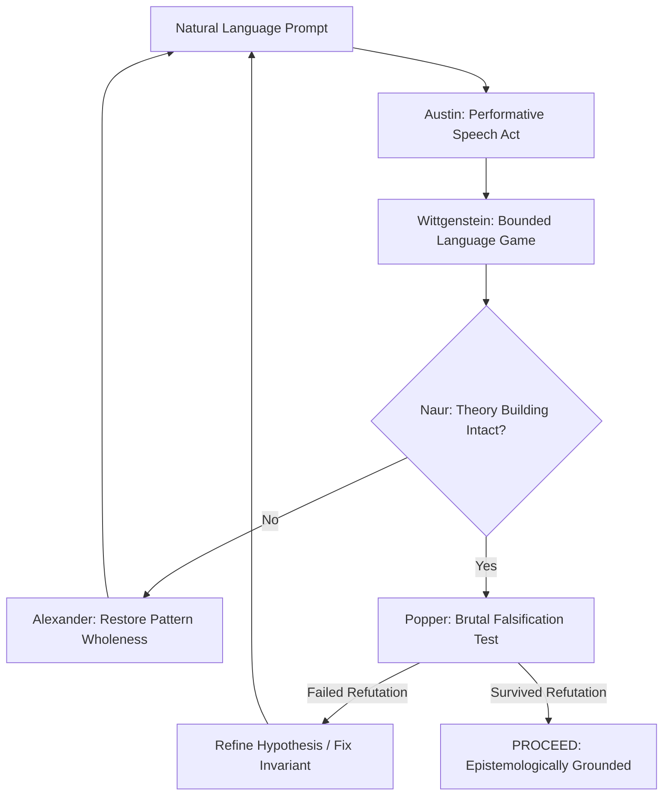

# VIBE CODER'S PHILOSOPHICAL & CONCEPTUAL ANALYSIS CANON
## The 50 Authoritative Books on Language, Epistemology, Cybernetics, and Conceptual Integrity

> Vibe coding represents an epistemological rupture: when natural language becomes code,
> **developers become ontologists and speech-act orchestrators**.
> This guide details the 50 foundational texts that provide the mental models to steer AI systems with clarity and depth.

---

## Philosophy of Language, Semantics & The Nature of Prompts

### #1. Philosophical Investigations
- **Author(s)**: Ludwig Wittgenstein
- **Publisher / Edition**: Wiley-Blackwell (2009 (4th Edition))
- **ISBN-10**: `1405159286` | **ISBN-13**: `978-1405159289`
- **Core Premise**: Meaning is use; language-games; private language argument; forms of life.
- **The Vibe Coder's Epistemic Edge**: The foundational text of prompting: LLMs are Wittgensteinian machines operating strictly on token usage patterns rather than objective Platonic referents.

### #2. How to Do Things with Words
- **Author(s)**: J. L. Austin
- **Publisher / Edition**: Harvard University Press (1975 (2nd Edition))
- **ISBN-10**: `0674411528` | **ISBN-13**: `978-0674411524`
- **Core Premise**: Speech Act Theory: Locutionary, illocutionary, and perlocutionary acts; performative utterances.
- **The Vibe Coder's Epistemic Edge**: Prompts are performative speech acts: they do not describe code, they execute realities and mutate computational state.

### #3. Gödel, Escher, Bach: An Eternal Golden Braid
- **Author(s)**: Douglas R. Hofstadter
- **Publisher / Edition**: Basic Books (1999 (20th Anniversary Edition))
- **ISBN-10**: `0465026567` | **ISBN-13**: `978-0465026562`
- **Core Premise**: Strange loops, formal systems, self-reference, recursive levels of abstraction.
- **The Vibe Coder's Epistemic Edge**: Teaches how recursive prompting loops and self-referential agent evaluation generate emergent reasoning.

### #4. Metaphors We Live By
- **Author(s)**: George Lakoff, Mark Johnson
- **Publisher / Edition**: University of Chicago Press (2003)
- **ISBN-10**: `0226468011` | **ISBN-13**: `978-0226468013`
- **Core Premise**: Conceptual metaphor theory; abstract thought is grounded in embodied physical metaphors.
- **The Vibe Coder's Epistemic Edge**: Shows how choice of metaphor in your prompt dictates the entire structural topology of generated code.

### #5. Tractatus Logico-Philosophicus
- **Author(s)**: Ludwig Wittgenstein
- **Publisher / Edition**: Routledge (2001)
- **ISBN-10**: `0415254086` | **ISBN-13**: `978-0415254083`
- **Core Premise**: The world is the totality of facts, not of things; logical atomism; the limits of language.
- **The Vibe Coder's Epistemic Edge**: Clarifies boundaries between what can be cleanly asserted in formal code vs. what must be shown through runtime execution.

### #6. Surfaces and Essences: Analogy as the Fuel and Fire of Thinking
- **Author(s)**: Douglas R. Hofstadter, Emmanuel Sander
- **Publisher / Edition**: Basic Books (2013)
- **ISBN-10**: `0465018475` | **ISBN-13**: `978-0465018475`
- **Core Premise**: Analogy-making as the core engine of cognition, categorization, and mental modeling.
- **The Vibe Coder's Epistemic Edge**: Unlocks advanced few-shot prompt design by leveraging cross-domain structural analogies.

### #7. The Meaning of Meaning
- **Author(s)**: C. K. Ogden, I. A. Richards
- **Publisher / Edition**: Harcourt Brace (1989)
- **ISBN-10**: `0156584468` | **ISBN-13**: `978-0156584463`
- **Core Premise**: The Semiotic Triangle: Symbol, Thought/Reference, and Referent.
- **The Vibe Coder's Epistemic Edge**: Dissects the illusion that an LLM understands the physical referent behind the tokens it manipulates.

### #8. Minds, Brains, and Science
- **Author(s)**: John R. Searle
- **Publisher / Edition**: Harvard University Press (1984)
- **ISBN-10**: `0674576330` | **ISBN-13**: `978-0674576339`
- **Core Premise**: The Chinese Room argument: Syntax is not semantics; formal symbols lack intentionality.
- **The Vibe Coder's Epistemic Edge**: Reminds the vibe coder that LLMs manipulate syntax without semantic comprehension; human judgment must supply meaning.

### #9. Word and Object
- **Author(s)**: W. V. O. Quine
- **Publisher / Edition**: The MIT Press (2013)
- **ISBN-10**: `0262518317` | **ISBN-13**: `978-0262518314`
- **Core Premise**: Indeterminacy of translation, semantic holism, ontological relativity.
- **The Vibe Coder's Epistemic Edge**: Explains why identical prompts produce subtly divergent implementations across different models and context windows.

### #10. Naming and Necessity
- **Author(s)**: Saul A. Kripke
- **Publisher / Edition**: Harvard University Press (1980)
- **ISBN-10**: `0674598466` | **ISBN-13**: `978-0674598461`
- **Core Premise**: Rigid designators, causal theory of reference, necessary a posteriori truths.
- **The Vibe Coder's Epistemic Edge**: Provides conceptual clarity when designing entity schemas, identity tokens, and domain models across agent sessions.

## Epistemology, Tacit Knowledge & Epistemic Opacity

### #11. The Tacit Dimension
- **Author(s)**: Michael Polanyi
- **Publisher / Edition**: University of Chicago Press (2009)
- **ISBN-10**: `0226672980` | **ISBN-13**: `978-0226672984`
- **Core Premise**: We can know more than we can tell; the irreducibility of tacit knowledge.
- **The Vibe Coder's Epistemic Edge**: The core paradox of vibe coding: explains why developers struggle to prompt what they instinctively know, and how to make intuition explicit.

### #12. The Logic of Scientific Discovery
- **Author(s)**: Karl R. Popper
- **Publisher / Edition**: Routledge (2002)
- **ISBN-10**: `0415278449` | **ISBN-13**: `978-0415278447`
- **Core Premise**: Falsificationism; demarcation problem; conjectures and refutations.
- **The Vibe Coder's Epistemic Edge**: The vibe coder's testing creed: you can never prove an AI-generated program correct by inspection; you must design tests that attempt to brutally falsify it.

### #13. The Structure of Scientific Revolutions
- **Author(s)**: Thomas S. Kuhn
- **Publisher / Edition**: University of Chicago Press (2012 (4th Edition))
- **ISBN-10**: `0226458121` | **ISBN-13**: `978-0226458120`
- **Core Premise**: Paradigm shifts, normal science, incommensurability, anomaly accumulation.
- **The Vibe Coder's Epistemic Edge**: Contextualizes the seismic paradigm shift from manual procedural coding to declarative stochastic orchestration.

### #14. The Philosophy of Information
- **Author(s)**: Luciano Floridi
- **Publisher / Edition**: Oxford University Press (2011)
- **ISBN-10**: `0199232385` | **ISBN-13**: `978-0199232383`
- **Core Premise**: Semantic information, Levels of Abstraction (LoA), informational ontology.
- **The Vibe Coder's Epistemic Edge**: Provides a rigorous ontological vocabulary for structuring inputs, context windows, and multi-modal knowledge representations.

### #15. The Beginning of Infinity: Explanations That Transform the World
- **Author(s)**: David Deutsch
- **Publisher / Edition**: Penguin Books (2012)
- **ISBN-10**: `0143121359` | **ISBN-13**: `978-0143121350`
- **Core Premise**: Good explanations, error correction, hard-to-vary criteria, reach.
- **The Vibe Coder's Epistemic Edge**: Distinguishes between generative mimicry (LLM pattern matching) and genuine explanatory knowledge.

### #16. Against Method: Outline of an Anarchistic Theory of Knowledge
- **Author(s)**: Paul Feyerabend
- **Publisher / Edition**: Verso (2010 (4th Edition))
- **ISBN-10**: `1844674428` | **ISBN-13**: `978-1844674428`
- **Core Premise**: Anything goes; methodological pluralism; critique of rigid scientific dogma.
- **The Vibe Coder's Epistemic Edge**: Justifies the iterative, opportunistic, polyglot experimentation inherent in rapid vibe coding workflows.

### #17. Personal Knowledge: Towards a Post-Critical Philosophy
- **Author(s)**: Michael Polanyi
- **Publisher / Edition**: University of Chicago Press (2015)
- **ISBN-10**: `022623262X` | **ISBN-13**: `978-0226232621`
- **Core Premise**: The fiduciary program; personal participation and commitment in objective science.
- **The Vibe Coder's Epistemic Edge**: Teaches that developer taste and personal aesthetic judgment are essential to evaluating AI-generated architectures.

### #18. The Black Swan: The Impact of the Highly Improbable
- **Author(s)**: Nassim Nicholas Taleb
- **Publisher / Edition**: Random House (2010 (2nd Edition))
- **ISBN-10**: `1400063515` | **ISBN-13**: `978-1400063512`
- **Core Premise**: Epistemic arrogance, silent evidence, narrative fallacy, fat tails.
- **The Vibe Coder's Epistemic Edge**: Warns against assuming AI code is safe because it passed 10 happy-path test runs; mandates deep negative testing.

### #19. Conjectures and Refutations: The Growth of Scientific Knowledge
- **Author(s)**: Karl R. Popper
- **Publisher / Edition**: Routledge (2002)
- **ISBN-10**: `0415285941` | **ISBN-13**: `978-0415285940`
- **Core Premise**: Bold hypotheses followed by relentless error elimination as the engine of progress.
- **The Vibe Coder's Epistemic Edge**: The perfect blueprint for agentic test-driven loops: generate bold candidate solutions, then apply ruthless automated verification.

### #20. Doubt and Certainty in Science
- **Author(s)**: J. Z. Young
- **Publisher / Edition**: Oxford University Press (1960)
- **ISBN-10**: `0195002040` | **ISBN-13**: `978-0195002041`
- **Core Premise**: The role of nervous systems and external symbolic models in structuring human belief.
- **The Vibe Coder's Epistemic Edge**: Illuminates how interactive AI chat interfaces reshape a developer's cognitive certainty and epistemic standards.

## Cybernetics, Feedback Loops & Second-Order Systems

### #21. Thinking in Systems: A Primer
- **Author(s)**: Donella H. Meadows
- **Publisher / Edition**: Chelsea Green Publishing (2008)
- **ISBN-10**: `1603580557` | **ISBN-13**: `978-1603580557`
- **Core Premise**: Stocks, flows, feedback loops, delays, leverage points in complex systems.
- **The Vibe Coder's Epistemic Edge**: Mandatory manual for agent orchestrators: teaches where to intervene in an agent loop to prevent chaotic cascades.

### #22. An Introduction to Cybernetics
- **Author(s)**: W. Ross Ashby
- **Publisher / Edition**: Chapman & Hall (1956)
- **ISBN-10**: `0416683002` | **ISBN-13**: `978-0416683004`
- **Core Premise**: The Law of Requisite Variety: Only variety can absorb variety.
- **The Vibe Coder's Epistemic Edge**: The Law of AI Swarms: to build an agent system that handles real-world complexity, toolbelt variety must match problem variety.

### #23. Cybernetics: Or Control and Communication in the Animal and the Machine
- **Author(s)**: Norbert Wiener
- **Publisher / Edition**: The MIT Press (1965 (2nd Edition))
- **ISBN-10**: `026273009X` | **ISBN-13**: `978-0262730099`
- **Core Premise**: Circular feedback causality, negative entropy, homeostatic equilibrium.
- **The Vibe Coder's Epistemic Edge**: Foundational principles of steering AI conversational loops through error-correcting output signals.

### #24. Steps to an Ecology of Mind
- **Author(s)**: Gregory Bateson
- **Publisher / Edition**: University of Chicago Press (2000)
- **ISBN-10**: `0226039056` | **ISBN-13**: `978-0226039053`
- **Core Premise**: Information as a difference that makes a difference; logical levels of learning; double binds.
- **The Vibe Coder's Epistemic Edge**: Helps debug prompt loops where agents get trapped in recursive double binds or confuse data with meta-context.

### #25. Brain of the Firm
- **Author(s)**: Stafford Beer
- **Publisher / Edition**: Wiley (1995 (2nd Edition))
- **ISBN-10**: `047194839X` | **ISBN-13**: `978-0471948391`
- **Core Premise**: The Viable System Model (VSM): recursive management of autonomous, self-sustaining units.
- **The Vibe Coder's Epistemic Edge**: Architectural masterclass for designing hierarchical multi-agent teams with autonomous operations and strategic coordination.

### #26. The Human Use of Human Beings: Cybernetics and Society
- **Author(s)**: Norbert Wiener
- **Publisher / Edition**: Da Capo Press (1988)
- **ISBN-10**: `0306803208` | **ISBN-13**: `978-0306803208`
- **Core Premise**: Moral, communicative, and political consequences of feedback automation.
- **The Vibe Coder's Epistemic Edge**: Explores the human role when machines take over the mechanical task of language and code manipulation.

### #27. Observing Systems
- **Author(s)**: Heinz von Foerster
- **Publisher / Edition**: Intersystems Publications (1984)
- **ISBN-10**: `0914105191` | **ISBN-13**: `978-0914105190`
- **Core Premise**: Second-order cybernetics: the cybernetics of observing systems; recursive epistemology.
- **The Vibe Coder's Epistemic Edge**: Reminds the vibe coder that the human observer is not outside the loop, but an active participant shaping model responses.

### #28. General System Theory: Foundations, Development, Applications
- **Author(s)**: Ludwig von Bertalanffy
- **Publisher / Edition**: George Braziller (1969)
- **ISBN-10**: `0807604534` | **ISBN-13**: `978-0807604533`
- **Core Premise**: Open systems, equifinality, structural isomorphism across disciplines.
- **The Vibe Coder's Epistemic Edge**: Guides the transfer of mental models across disparate domains (biology to distributed systems) via AI prompting.

### #29. The Tree of Knowledge: The Biological Roots of Human Understanding
- **Author(s)**: Humberto R. Maturana, Francisco J. Varela
- **Publisher / Edition**: Shambhala (1992)
- **ISBN-10**: `0877736421` | **ISBN-13**: `978-0877736424`
- **Core Premise**: Autopoiesis, structural coupling, enactive cognition.
- **The Vibe Coder's Epistemic Edge**: Reconceptualizes software not as static artifacts, but as autopoietic organisms structurally coupled to their environment.

### #30. Micromotives and Macrobehavior
- **Author(s)**: Thomas C. Schelling
- **Publisher / Edition**: W. W. Norton & Company (2006)
- **ISBN-10**: `0393329461` | **ISBN-13**: `978-0393329469`
- **Core Premise**: Aggregation mechanisms: how simple individual micro-rules produce emergent macro-states.
- **The Vibe Coder's Epistemic Edge**: Explains how tiny prompt nuances across multiple subagents compound into dramatic system-wide behavioral shifts.

## Ontology, Abstraction & Conceptual Integrity in Software

### #31. The Timeless Way of Building
- **Author(s)**: Christopher Alexander
- **Publisher / Edition**: Oxford University Press (1979)
- **ISBN-10**: `0195024028` | **ISBN-13**: `978-0195024029`
- **Core Premise**: The Quality Without a Name (QWAN); organic wholeness; generative pattern languages.
- **The Vibe Coder's Epistemic Edge**: The bible of software aesthetics: teaches developers how to recognize wholeness, coherence, and life in system architectures.

### #32. Notes on the Synthesis of Form
- **Author(s)**: Christopher Alexander
- **Publisher / Edition**: Harvard University Press (1964)
- **ISBN-10**: `0674627512` | **ISBN-13**: `978-0674627512`
- **Core Premise**: Deconstructing complex design problems into misfits, constraints, and structural diagrams.
- **The Vibe Coder's Epistemic Edge**: Masterclass in decomposing large software requirements into orthogonal, promptable domain boundaries.

### #33. The Design of Design: Essays from a Computer Scientist
- **Author(s)**: Frederick P. Brooks Jr.
- **Publisher / Edition**: Addison-Wesley Professional (2010)
- **ISBN-10**: `0201362988` | **ISBN-13**: `978-0201362985`
- **Core Premise**: Conceptual integrity as the most critical attribute of design; collaborative design dynamics.
- **The Vibe Coder's Epistemic Edge**: Reminds builders that speed of code generation is irrelevant if the resulting system lacks a single coherent design vision.

### #34. Computing: A Human Activity (contains Programming as Theory Building)
- **Author(s)**: Peter Naur
- **Publisher / Edition**: ACM Press / Addison-Wesley (1992)
- **ISBN-10**: `0201580691` | **ISBN-13**: `978-0201580693`
- **Core Premise**: Programming is not about writing lines of code; it is constructing a shared mental theory of the world.
- **The Vibe Coder's Epistemic Edge**: The vibe coder's greatest warning: when the AI writes the code, who holds the theory? Forces developers to actively internalize architecture.

### #35. On the Origin of Objects
- **Author(s)**: Brian Cantwell Smith
- **Publisher / Edition**: The MIT Press (1996)
- **ISBN-10**: `0262193639` | **ISBN-13**: `978-0262193634`
- **Core Premise**: Metaphysical critique of computational representation; how systems register objects out of reality.
- **The Vibe Coder's Epistemic Edge**: Fundamental computational philosophy: dissects what an object, state, or data structure fundamentally represents.

### #36. Process and Reality
- **Author(s)**: Alfred North Whitehead
- **Publisher / Edition**: Free Press (1979 (Corrected Edition))
- **ISBN-10**: `0029345707` | **ISBN-13**: `978-0029345702`
- **Core Premise**: Process philosophy: reality consists of events, transitions, and processes, not static substances.
- **The Vibe Coder's Epistemic Edge**: Aligns perfectly with modern event-driven, stream-oriented, and asynchronous agent architectures.

### #37. Zen and the Art of Motorcycle Maintenance
- **Author(s)**: Robert M. Pirsig
- **Publisher / Edition**: William Morrow (2006)
- **ISBN-10**: `0060589469` | **ISBN-13**: `978-0060589462`
- **Core Premise**: The Metaphysics of Quality; classic vs. romantic understanding; care and craftsmanship.
- **The Vibe Coder's Epistemic Edge**: Cultivates deep care: vibe coding must balance romantic creative flow with classical analytical rigor.

### #38. Category Theory for the Working Mathematician
- **Author(s)**: Saunders Mac Lane
- **Publisher / Edition**: Springer (1998 (2nd Edition))
- **ISBN-10**: `0387984038` | **ISBN-13**: `978-0387984032`
- **Core Premise**: Objects, morphisms, functors, natural transformations, universal properties.
- **The Vibe Coder's Epistemic Edge**: The ultimate mathematical abstraction: enables vibe coders to prompt for composable, provably sound architectural interfaces.

### #39. The Art of the Metaobject Protocol
- **Author(s)**: Gregor Kiczales, Jim des Rivières, Daniel G. Bobrow
- **Publisher / Edition**: The MIT Press (1991)
- **ISBN-10**: `0262610744` | **ISBN-13**: `978-0262610742`
- **Core Premise**: Introspection, reflection, meta-programming, open implementations.
- **The Vibe Coder's Epistemic Edge**: Teaches how systems can inspect, rewrite, and dynamically alter their own execution behaviors—vital for self-healing agents.

### #40. Conceptual Structures: Information Processing in Mind and Machine
- **Author(s)**: John F. Sowa
- **Publisher / Edition**: Addison-Wesley (1984)
- **ISBN-10**: `0201144727` | **ISBN-13**: `978-0201144727`
- **Core Premise**: Semantic networks, conceptual graphs, existential graphs, ontological engineering.
- **The Vibe Coder's Epistemic Edge**: Bridges the gap between natural language prompts and structured knowledge representations.

## Philosophy of Mind, Extended Cognition & AI Limits

### #41. Supersizing the Mind: Embodiment, Action, and Cognitive Extension
- **Author(s)**: Andy Clark
- **Publisher / Edition**: Oxford University Press (2008)
- **ISBN-10**: `0195333217` | **ISBN-13**: `978-0195333213`
- **Core Premise**: The Extended Mind Thesis: Cognition leaks into and incorporates the external environment.
- **The Vibe Coder's Epistemic Edge**: The theoretical justification for vibe coding: the prompt window and agent tools are literal extensions of your active mind.

### #42. The Concept of Mind
- **Author(s)**: Gilbert Ryle
- **Publisher / Edition**: Routledge (2009 (60th Anniversary Edition))
- **ISBN-10**: `0415485479` | **ISBN-13**: `978-0415485470`
- **Core Premise**: Category mistakes; the ghost in the machine dogma; knowing-how vs. knowing-that.
- **The Vibe Coder's Epistemic Edge**: Prevents category errors in prompting: distinguishes declarative factual recall (knowing-that) from procedural execution (knowing-how).

### #43. The Intentional Stance
- **Author(s)**: Daniel C. Dennett
- **Publisher / Edition**: The MIT Press (1987)
- **ISBN-10**: `0262540533` | **ISBN-13**: `978-0262540537`
- **Core Premise**: Physical stance vs. design stance vs. intentional stance for predicting complex system behavior.
- **The Vibe Coder's Epistemic Edge**: Pragmatic philosophy: explains why treating LLMs as intentional agents (with beliefs and goals) is an effective engineering heuristic.

### #44. What Computers Still Can't Do: A Critique of Artificial Reason
- **Author(s)**: Hubert L. Dreyfus
- **Publisher / Edition**: The MIT Press (1992)
- **ISBN-10**: `0262540673` | **ISBN-13**: `978-0262540674`
- **Core Premise**: Phenomenological critique of AI; the necessity of embodied, situated, tacit background context.
- **The Vibe Coder's Epistemic Edge**: Pinpoints the exact failure modes of AI: edge cases that require unstated real-world embodiment and lived context.

### #45. The Promise of Artificial Intelligence: Reckoning and Judgment
- **Author(s)**: Brian Cantwell Smith
- **Publisher / Edition**: The MIT Press (2019)
- **ISBN-10**: `0262043041` | **ISBN-13**: `978-0262043045`
- **Core Premise**: Distinction between Reckoning (calculative, mechanical intelligence) and Judgment (ethical, contextual discernment).
- **The Vibe Coder's Epistemic Edge**: Explains why LLMs excel at mechanical code reckoning, but humans must retain irrevocable responsibility for architectural judgment.

### #46. The Conscious Mind: In Search of a Fundamental Theory
- **Author(s)**: David J. Chalmers
- **Publisher / Edition**: Oxford University Press (1996)
- **ISBN-10**: `0195117891` | **ISBN-13**: `978-0195117899`
- **Core Premise**: The Hard Problem of consciousness; philosophical zombies; informational dualism.
- **The Vibe Coder's Epistemic Edge**: Clarifies the boundary between behavioral simulation (what LLMs do) and subjective experience.

## Philosophy of Technology, Instrumentalism & The Machine Age

### #47. The Question Concerning Technology and Other Essays
- **Author(s)**: Martin Heidegger
- **Publisher / Edition**: Harper Perennial (1977)
- **ISBN-10**: `0061319694` | **ISBN-13**: `978-0061319693`
- **Core Premise**: Gestell (Enframing); technology as a way of revealing; treating the world as standing-reserve.
- **The Vibe Coder's Epistemic Edge**: Essential existential warning: prevents developers from reducing reality and code to mere instrumental, disposable standing-reserve.

### #48. The Technological Society
- **Author(s)**: Jacques Ellul
- **Publisher / Edition**: Vintage (1964)
- **ISBN-10**: `0394703901` | **ISBN-13**: `978-0394703909`
- **Core Premise**: La Technique: the autonomous, self-augmenting pursuit of absolute technical efficiency.
- **The Vibe Coder's Epistemic Edge**: Warns against the blind worship of generation speed; challenges whether building things faster actually serves human flourishing.

### #49. Technics and Civilization
- **Author(s)**: Lewis Mumford
- **Publisher / Edition**: University of Chicago Press (2010)
- **ISBN-10**: `0226550273` | **ISBN-13**: `978-0226550275`
- **Core Premise**: The Megamachine; technological evolution as a reflection of cultural and spiritual values.
- **The Vibe Coder's Epistemic Edge**: Prompts reflection on how software tools shape human societal organization and individual autonomy.

### #50. Amusing Ourselves to Death: Public Discourse in the Age of Show Business
- **Author(s)**: Neil Postman
- **Publisher / Edition**: Penguin Books (2005 (20th Anniversary Edition))
- **ISBN-10**: `014303653X` | **ISBN-13**: `978-0143036531`
- **Core Premise**: The medium is the metaphor; technological epistemologies shape what constitutes truth and coherence.
- **The Vibe Coder's Epistemic Edge**: Cautionary lesson: ensures conversational chat interfaces do not degrade deep architectural thought into shallow soundbites.

---
## The Vibe Coder's Philosophical Reasoning Dialectic

