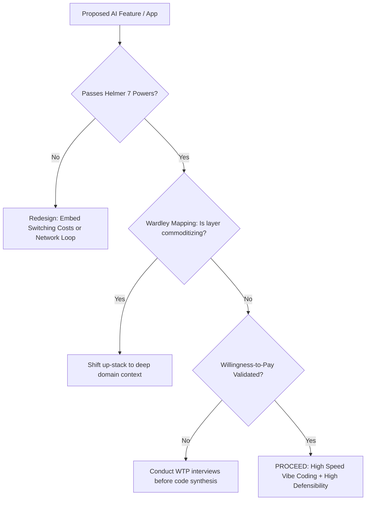

# VIBE CODER'S STRATEGIC & COMPETITIVE ANALYSIS CANON
## The 50 Authoritative Books on Moats, Value Chains, Platforms, and Monetization

> In an era where generative AI reduces the marginal cost of code synthesis to zero,
> **code syntax is no longer a defensible barrier**. Pure implementation speed is commoditized.
> This guide details the 50 foundational texts that teach builders how to engineer defensible software businesses.

---

## Structural Defensibility, Moats & Economic Powers

### #1. 7 Powers: The Foundations of Business Strategy
- **Author(s)**: Hamilton Helmer
- **Publisher / Edition**: Deep Strategy (2016)
- **ISBN-10**: `0998116319` | **ISBN-13**: `978-0998116310`
- **Core Premise**: The 7 durable barriers: Scale Economies, Network Economies, Counter-Positioning, Switching Costs, Branding, Cornered Resource, Process Power.
- **The Vibe Coder's Moat**: The core filter for vibe coders: proves whether an AI product has structural economic power once the code is generated.

### #2. Competitive Strategy: Techniques for Analyzing Industries and Competitors
- **Author(s)**: Michael E. Porter
- **Publisher / Edition**: Free Press (1998 (Reprint))
- **ISBN-10**: `0684841487` | **ISBN-13**: `978-0684841489`
- **Core Premise**: Porter's Five Forces: Supplier Power, Buyer Power, Competitive Rivalry, Threat of Substitution, Barriers to Entry.
- **The Vibe Coder's Moat**: Analyzes margin erosion when upstream AI foundation model providers (suppliers) commoditize app wrappers.

### #3. Competitive Advantage: Creating and Sustaining Superior Performance
- **Author(s)**: Michael E. Porter
- **Publisher / Edition**: Free Press (1998 (Reprint))
- **ISBN-10**: `0684841460` | **ISBN-13**: `978-0684841465`
- **Core Premise**: Cost leadership, differentiation, focus, and value chain disaggregation.
- **The Vibe Coder's Moat**: Shows how to isolate the specific activity in your customer's value chain where AI generates genuine cost or differentiation advantages.

### #4. Understanding Michael Porter: The Essential Guide to Competition and Strategy
- **Author(s)**: Joan Magretta
- **Publisher / Edition**: Harvard Business Review Press (2011)
- **ISBN-10**: `1422160599` | **ISBN-13**: `978-1422160596`
- **Core Premise**: Modern, concise synthesis of Porter's core economic frameworks.
- **The Vibe Coder's Moat**: Avoids the zero-sum 'competition to be the best' (feature bloat) in favor of 'competing to be unique'.

### #5. Good Strategy/Bad Strategy: The Difference and Why It Matters
- **Author(s)**: Richard P. Rumelt
- **Publisher / Edition**: Crown Business (2011)
- **ISBN-10**: `0307886239` | **ISBN-13**: `978-0307886231`
- **Core Premise**: The Kernel of Strategy: Diagnosis, Guiding Policy, and Coherent Action vs. empty goal-setting.
- **The Vibe Coder's Moat**: Stops vibe coders from confusing 'ship 10 features this weekend' with an actual coherent competitive strategy.

### #6. The Crux: How Leaders Become Strategists
- **Author(s)**: Richard P. Rumelt
- **Publisher / Edition**: PublicAffairs (2022)
- **ISBN-10**: `1541701240` | **ISBN-13**: `978-1541701243`
- **Core Premise**: Identifying the single most critical, addressable challenge standing between you and market dominance.
- **The Vibe Coder's Moat**: Teaches focus: solving the hardest bottleneck (e.g., proprietary data pipeline) rather than generating 20 peripheral UI components.

### #7. Competition Demystified: A Radically Simplified Approach to Business Strategy
- **Author(s)**: Bruce Greenwald, Judd Kahn
- **Publisher / Edition**: Portfolio (2005)
- **ISBN-10**: `1591841801` | **ISBN-13**: `978-1591841807`
- **Core Premise**: Simplifies strategic analysis down to a single dominant variable: Barriers to Entry.
- **The Vibe Coder's Moat**: Helps answer the only question that matters: 'What prevents 500 other developers from copying this prompt tomorrow?'

### #8. Modern Competitive Analysis
- **Author(s)**: Sharon M. Oster
- **Publisher / Edition**: Oxford University Press (1999 (3rd Edition))
- **ISBN-10**: `019511941X` | **ISBN-13**: `978-0195119411`
- **Core Premise**: Industrial organization economics applied to business competition and strategic groups.
- **The Vibe Coder's Moat**: Provides formal economic rigor on game-theoretic entry deterrence and irreversible investments.

### #9. The Origin of Wealth: The Radical Remaking of Economics and What It Means for Business and Society
- **Author(s)**: Eric D. Beinhocker
- **Publisher / Edition**: Harvard Business Review Press (2007)
- **ISBN-10**: `1422121038` | **ISBN-13**: `978-1422121030`
- **Core Premise**: Complexity economics, evolutionary business strategies, adaptive fitness landscapes.
- **The Vibe Coder's Moat**: Models fast-moving AI markets as complex adaptive systems rather than static equilibrium industries.

### #10. Strategy Rules: Five Timeless Lessons from Bill Gates, Andy Grove, and Steve Jobs
- **Author(s)**: David B. Yoffie, Michael A. Cusumano
- **Publisher / Edition**: Harper Business (2015)
- **ISBN-10**: `0062373951` | **ISBN-13**: `978-0062373953`
- **Core Premise**: Look forward, reason back; build platforms; exploit industry inflection points.
- **The Vibe Coder's Moat**: Shows how to anticipate where foundation model providers are heading and build where they won't tread.

## Platform Economics, Network Effects & Aggregation Strategy

### #11. Platform Revolution: How Networked Markets Are Transforming the Economy
- **Author(s)**: Geoffrey G. Parker, Marshall W. Van Alstyne, Sangeet Paul Choudary
- **Publisher / Edition**: W. W. Norton & Company (2016)
- **ISBN-10**: `0393249131` | **ISBN-13**: `978-0393249132`
- **Core Premise**: How platform business models beat pipeline models via external ecosystem production.
- **The Vibe Coder's Moat**: Guides transitioning a single-player vibe-coded SaaS into a multi-sided marketplace or exchange.

### #12. The Business of Platforms: Strategy in the Age of Digital Competition, Innovation, and Power
- **Author(s)**: Michael A. Cusumano, Annabelle Gawer, David B. Yoffie
- **Publisher / Edition**: Harper Business (2019)
- **ISBN-10**: `0062896326` | **ISBN-13**: `978-0062896322`
- **Core Premise**: Transaction Platforms, Innovation Platforms, and Hybrid Platform dynamics.
- **The Vibe Coder's Moat**: Identifies why pure AI wrapper tools fail and how to build an 'innovation platform' that other developers extend.

### #13. The Cold Start Problem: How to Start and Scale Network Effects
- **Author(s)**: Andrew Chen
- **Publisher / Edition**: Harper Business (2021)
- **ISBN-10**: `0062969749` | **ISBN-13**: `978-0062969743`
- **Core Premise**: Atomic networks, tipping points, hard side of the network, anti-network effects.
- **The Vibe Coder's Moat**: Solves the chicken-and-egg distribution dilemma for AI products that rely on user interactions to improve.

### #14. Matchmakers: The New Economics of Multisided Platforms
- **Author(s)**: David S. Evans, Richard Schmalensee
- **Publisher / Edition**: Harvard Business Review Press (2016)
- **ISBN-10**: `1633691721` | **ISBN-13**: `978-1633691728`
- **Core Premise**: Frictions, catalytic businesses, pricing symmetry, multi-homing prevention.
- **The Vibe Coder's Moat**: Teaches how to design economic incentives so both sides of your AI marketplace refuse to defect to copycats.

### #15. Invisible Engines: How the Software Platforms Drive Innovation and Transform Industries
- **Author(s)**: David S. Evans, Andrei Hagiu, Richard Schmalensee
- **Publisher / Edition**: The MIT Press (2006)
- **ISBN-10**: `0262050854` | **ISBN-13**: `978-0262050852`
- **Core Premise**: Historical economics of software platforms: Windows, Symbian, Palm, and web platforms.
- **The Vibe Coder's Moat**: Shows how software platforms capture platform surplus and maintain developer stickiness.

### #16. Modern Monopolies: What It Takes to Dominate the 21st-Century Economy
- **Author(s)**: Alex Moazed, Nicholas L. Johnson
- **Publisher / Edition**: St. Martin's Press (2016)
- **ISBN-10**: `1250091896` | **ISBN-13**: `978-1250091895`
- **Core Premise**: Platform economics, zero marginal cost of connection, decentralized inventory.
- **The Vibe Coder's Moat**: Teaches vibe coders how to build networks that own the transaction rails rather than manufacturing features.

### #17. Zero to One: Notes on Startups, or How to Build the Future
- **Author(s)**: Peter Thiel with Blake Masters
- **Publisher / Edition**: Crown Business (2014)
- **ISBN-10**: `0804139296` | **ISBN-13**: `978-0804139298`
- **Core Premise**: Escaping competition, secrets, monopoly through 10x proprietary tech, network effects, scale.
- **The Vibe Coder's Moat**: Reminds AI builders that copying an existing app with an LLM creates 1 to N, not 0 to 1.

### #18. Information Rules: A Strategic Guide to the Network Economy
- **Author(s)**: Carl Shapiro, Hal R. Varian
- **Publisher / Edition**: Harvard Business Review Press (1998)
- **ISBN-10**: `087584863X` | **ISBN-13**: `978-0875848631`
- **Core Premise**: Lock-in, switching costs, versioning, positive feedback loops, standard wars.
- **The Vibe Coder's Moat**: Written by Google's Chief Economist: the foundational economic mechanics of digital pricing and lock-in.

### #19. The Keystone Advantage: What the New Dynamics of Business Ecosystems Mean for Strategy, Innovation, and Sustainability
- **Author(s)**: Marco Iansiti, Roy Levien
- **Publisher / Edition**: Harvard Business Review Press (2004)
- **ISBN-10**: `1591393078` | **ISBN-13**: `978-1591393078`
- **Core Premise**: Biological ecosystem analogy: Keystone vs. Dominator vs. Niche players in business webs.
- **The Vibe Coder's Moat**: How to position your AI product as a beneficial 'keystone' in an ecosystem rather than an extractive dominator.

### #20. Platform Strategy: How to Unlock the Power of Communities and Networks to Grow Your Business
- **Author(s)**: Laure Claire Reillier, Benoit Reillier
- **Publisher / Edition**: Routledge (2017)
- **ISBN-10**: `1472480244` | **ISBN-13**: `978-1472480248`
- **Core Premise**: The Rocket Model: attract, match, connect, transact, optimize.
- **The Vibe Coder's Moat**: Practical operational framework for architecting self-reinforcing loops in user-facing AI platforms.

## Disruption Theory, Technology Lifecycles & Value Chain Evolution

### #21. The Innovator's Dilemma: When New Technologies Cause Great Firms to Fail
- **Author(s)**: Clayton M. Christensen
- **Publisher / Edition**: Harvard Business Review Press (2016 (Reprint))
- **ISBN-10**: `1633691780` | **ISBN-13**: `978-1633691780`
- **Core Premise**: Disruptive vs. sustaining innovation, low-end footholds, new-market disruption.
- **The Vibe Coder's Moat**: Shows how vibe coders can target non-consumers and low-margin niches that incumbent software giants ignore.

### #22. The Innovator's Solution: Creating and Sustaining Successful Growth
- **Author(s)**: Clayton M. Christensen, Michael E. Raynor
- **Publisher / Edition**: Harvard Business Review Press (2013 (Reprint))
- **ISBN-10**: `1422196577` | **ISBN-13**: `978-1422196571`
- **Core Premise**: The Law of Conservation of Attractive Profits: When a product becomes modular, profits shift to proprietary subsystems.
- **The Vibe Coder's Moat**: When code generation commoditizes, attractive profits shift to proprietary data and high-context workflows.

### #23. Crossing the Chasm: Marketing and Selling Disruptive Products to Mainstream Customers
- **Author(s)**: Geoffrey A. Moore
- **Publisher / Edition**: Harper Business (2014 (3rd Edition))
- **ISBN-10**: `0062292986` | **ISBN-13**: `978-0062292988`
- **Core Premise**: The Technology Adoption Life Cycle: Moving from Innovators/Early Adopters to Pragmatists in the bowling alley.
- **The Vibe Coder's Moat**: Prevents getting stuck in the 'tech-enthusiast bubble' with shiny AI demos that mainstream buyers won't touch.

### #24. Inside the Tornado: Strategies for Developing, Leveraging, and Surviving Hypergrowth Markets
- **Author(s)**: Geoffrey A. Moore
- **Publisher / Edition**: Harper Business (2004)
- **ISBN-10**: `0060653647` | **ISBN-13**: `978-0060653644`
- **Core Premise**: Market dynamics during hypergrowth: Bowling Alley, Tornado, Main Street.
- **The Vibe Coder's Moat**: How to position your vibe-coded product when an AI market segment enters a hypergrowth 'tornado'.

### #25. Wardley Mapping: Topographical Intelligence in Business
- **Author(s)**: Simon Wardley
- **Publisher / Edition**: Independent Publishing (2018)
- **ISBN-10**: `1729606822` | **ISBN-13**: `978-1729606827`
- **Core Premise**: Evolution of value chains: Genesis -> Custom-Built -> Product -> Commodity/Utility.
- **The Vibe Coder's Moat**: Essential visual strategy: maps out exactly which components of your AI stack are commoditizing into utilities.

### #26. Escape Velocity: Free Your Company's Future from the Pull of the Past
- **Author(s)**: Geoffrey A. Moore
- **Publisher / Edition**: Harper Business (2011)
- **ISBN-10**: `0062040898` | **ISBN-13**: `978-0062040893`
- **Core Premise**: Portfolio management, categories in secular decline vs. category growth.
- **The Vibe Coder's Moat**: Helps you ruthlessly decommission zombie AI experiments to reallocate velocity to your core growth engine.

### #27. Seeing What's Next: Using the Theories of Innovation to Predict Industry Change
- **Author(s)**: Clayton M. Christensen, Scott D. Anthony, Erik A. Roth
- **Publisher / Edition**: Harvard Business Review Press (2004)
- **ISBN-10**: `1591391857` | **ISBN-13**: `978-1591391852`
- **Core Premise**: Using innovation theory to forecast competitive battles and industry structure changes.
- **The Vibe Coder's Moat**: Evaluates whether your AI product faces threats from upstream platform providers or downstream customer integrators.

### #28. Zone to Win: Organizing to Compete in an Age of Disruption
- **Author(s)**: Geoffrey A. Moore
- **Publisher / Edition**: Diversion Books (2015)
- **ISBN-10**: `1626818169` | **ISBN-13**: `978-1626818163`
- **Core Premise**: Four operational zones: Performance, Productivity, Incubation, Transformation.
- **The Vibe Coder's Moat**: Structural advice on managing rapid vibe-prototyping experiments without bankrupting core revenue operations.

### #29. The Gorilla Game: An Investor's Guide to Picking Winners in High Technology
- **Author(s)**: Geoffrey A. Moore, Paul Johnson, Tom Kippola
- **Publisher / Edition**: Harper Business (1999)
- **ISBN-10**: `0887309577` | **ISBN-13**: `978-0887309571`
- **Core Premise**: Identifying Gorillas, Chimps, and Monkeys in proprietary software architecture battles.
- **The Vibe Coder's Moat**: How to identify whether your product can become the dominant architectural standard or should partner with one.

### #30. Only the Paranoid Survive: How to Exploit the Crisis Points That Challenge Every Company
- **Author(s)**: Andrew S. Grove
- **Publisher / Edition**: Currency / Doubleday (1996)
- **ISBN-10**: `0385482582` | **ISBN-13**: `978-0385482585`
- **Core Premise**: Strategic Inflection Points (10X shifts in market forces), navigating the Valley of Death.
- **The Vibe Coder's Moat**: Guides your mindset when foundation models suddenly release a native feature that overlaps 80% of your product.

## Positioning, Value Innovation & Market Creation (Blue Oceans)

### #31. Blue Ocean Strategy: How to Create Uncontested Market Space and Make the Competition Irrelevant
- **Author(s)**: W. Chan Kim, Renée Mauborgne
- **Publisher / Edition**: Harvard Business Review Press (2015 (Expanded Edition))
- **ISBN-10**: `1625274491` | **ISBN-13**: `978-1625274496`
- **Core Premise**: Value Innovation: eliminate, reduce, raise, and create factors to break the value-cost trade-off.
- **The Vibe Coder's Moat**: Eliminates unnecessary enterprise complexity while raising speed and delightful UX to open uncontested territory.

### #32. Blue Ocean Shift: Beyond Competing - Proven Steps to Inspire Confidence and Seize New Growth
- **Author(s)**: W. Chan Kim, Renée Mauborgne
- **Publisher / Edition**: Hachette Books (2017)
- **ISBN-10**: `1610398149` | **ISBN-13**: `978-1610398145`
- **Core Premise**: Step-by-step roadmap to move from crowded red oceans to uncontested market space.
- **The Vibe Coder's Moat**: Practical Pioneer-Migrator-Settler maps to steer your AI project portfolio toward differentiation.

### #33. Obviously Awesome: How to Nail Product Positioning so Customers Get It, Buy It, Love It
- **Author(s)**: April Dunford
- **Publisher / Edition**: Ambient Press (2019)
- **ISBN-10**: `1999023005` | **ISBN-13**: `978-1999023003`
- **Core Premise**: The 10-step positioning methodology: competitive alternatives, unique attributes, value, customer segments.
- **The Vibe Coder's Moat**: Helps vibe coders realize that your competitor is often not another AI tool, but 'an ugly Excel spreadsheet'.

### #34. Positioning: The Battle for Your Mind
- **Author(s)**: Al Ries, Jack Trout
- **Publisher / Edition**: McGraw-Hill (2001 (20th Anniversary Edition))
- **ISBN-10**: `0071373586` | **ISBN-13**: `978-0071373586`
- **Core Premise**: Owning a singular word or concept in the prospect's mental category hierarchy.
- **The Vibe Coder's Moat**: In an avalanche of generic 'AI copilots', ensures your product stands for one clear, indelible concept.

### #35. Sales Pitch: How to Craft a Story to Stand Out and Win
- **Author(s)**: April Dunford
- **Publisher / Edition**: Ambient Press (2023)
- **ISBN-10**: `1778216706` | **ISBN-13**: `978-1778216701`
- **Core Premise**: Crafting customer-centric narratives that translate unique technical positioning into closed deals.
- **The Vibe Coder's Moat**: Teaches developers how to demo an AI application so buyers immediately perceive ROI rather than technical novelty.

### #36. The 22 Immutable Laws of Marketing
- **Author(s)**: Al Ries, Jack Trout
- **Publisher / Edition**: Harper Business (1993)
- **ISBN-10**: `0887306667` | **ISBN-13**: `978-0887306662`
- **Core Premise**: The Law of Leadership, Law of Category, Law of the Mind, Law of Focus.
- **The Vibe Coder's Moat**: Reminds builders: 'It's better to be first in a new category than to be better in an existing one.'

### #37. Playing to Win: How Strategy Really Works
- **Author(s)**: A.G. Lafley, Roger L. Martin
- **Publisher / Edition**: Harvard Business Review Press (2013)
- **ISBN-10**: `142218739X` | **ISBN-13**: `978-1422187395`
- **Core Premise**: The Strategic Choice Cascade: Winning Aspiration, Where to Play, How to Win, Capabilities, Systems.
- **The Vibe Coder's Moat**: Forces you to make explicit trade-offs on where NOT to play, saving months of fruitless feature prompting.

### #38. Different: Escaping the Competitive Herd
- **Author(s)**: Youngme Moon
- **Publisher / Edition**: Crown Business (2010)
- **ISBN-10**: `030746086X` | **ISBN-13**: `978-0307460868`
- **Core Premise**: Reverse positioning, breakaway positioning, and hostile positioning to escape conformist features.
- **The Vibe Coder's Moat**: Explains why adding 50 AI features makes you look identical to competitors; shows how to strip away 80% to stand out.

### #39. Competing Against Luck: The Story of Innovation and Customer Choice
- **Author(s)**: Clayton M. Christensen, Taddy Hall, Karen Dillon, David S. Duncan
- **Publisher / Edition**: Harper Business (2016)
- **ISBN-10**: `0062435612` | **ISBN-13**: `978-0062435613`
- **Core Premise**: Jobs-to-be-Done (JTBD) Theory: Customers don't buy products; they 'hire' them to make progress.
- **The Vibe Coder's Moat**: Identifies the emotional, social, and functional 'job' your user is hiring your AI tool to accomplish.

### #40. Demand-Side Sales 101: Stop Selling and Help Your Customers Make Progress
- **Author(s)**: Bob Moesta
- **Publisher / Edition**: Lioncrest Publishing (2020)
- **ISBN-10**: `1544509987` | **ISBN-13**: `978-1544509983`
- **Core Premise**: The Forces of Progress: Push of current situation, Pull of new idea, Anxiety of new solution, Habit of present.
- **The Vibe Coder's Moat**: Teaches why users don't adopt your vibe-coded tool even if it's 10x faster: managing switching anxiety.

## Game Theory, Competitive Wargaming & Strategic Maneuvering

### #41. Co-opetition: A Revolutionary Mindset That Combines Competition and Cooperation
- **Author(s)**: Adam M. Brandenburger, Barry J. Nalebuff
- **Publisher / Edition**: Currency / Doubleday (1996)
- **ISBN-10**: `0385516002` | **ISBN-13**: `978-0385516006`
- **Core Premise**: The PARTS framework (Players, Added values, Rules, Tactics, Scope) and the Value Net.
- **The Vibe Coder's Moat**: Teaches how to cooperate with upstream LLM providers while fiercely capturing your own added value.

### #42. Thinking Strategically: The Competitive Edge in Business, Politics, and Everyday Life
- **Author(s)**: Avinash K. Dixit, Barry J. Nalebuff
- **Publisher / Edition**: W. W. Norton & Company (1991)
- **ISBN-10**: `0393310353` | **ISBN-13**: `978-0393310351`
- **Core Premise**: Game-theoretic concepts: backward induction, commitments, credible threats, prisoner's dilemma.
- **The Vibe Coder's Moat**: Helps predict competitor reactions before you launch aggressive pricing moves or open-source strategies.

### #43. The Art of Strategy: A Game Theorist's Guide to Success in Business and Life
- **Author(s)**: Avinash K. Dixit, Barry J. Nalebuff
- **Publisher / Edition**: W. W. Norton & Company (2008)
- **ISBN-10**: `0393337170` | **ISBN-13**: `978-0393337174`
- **Core Premise**: Modernized guide to strategic game theory in business and everyday negotiations.
- **The Vibe Coder's Moat**: Practical intuition on designing mechanism incentives that force competitors into suboptimal moves.

### #44. Strategy: An Introduction to Game Theory
- **Author(s)**: Joel Watson
- **Publisher / Edition**: W. W. Norton & Company (2013 (3rd Edition))
- **ISBN-10**: `0393918386` | **ISBN-13**: `978-0393918380`
- **Core Premise**: Formal mathematical foundation of extensive-form games, Nash equilibrium, signaling.
- **The Vibe Coder's Moat**: Rigorous modeling of repeated games, imperfect information, and strategic signaling in software markets.

### #45. Business Wargaming: Securing Corporate Value
- **Author(s)**: Daniel F. Oriesek, Jan Oliver Schwarz
- **Publisher / Edition**: Routledge / Gower (2008)
- **ISBN-10**: `0566088282` | **ISBN-13**: `978-0566088285`
- **Core Premise**: Simulating competitor moves, red-teaming business vulnerabilities, strategic role-play.
- **The Vibe Coder's Moat**: Run wargaming exercises: 'If Microsoft/Google bundles this feature into Office tomorrow, how do we survive?'

### #46. The Art of War
- **Author(s)**: Sun Tzu (trans. Samuel B. Griffith)
- **Publisher / Edition**: Oxford University Press (1971)
- **ISBN-10**: `0195014766` | **ISBN-13**: `978-0195014761`
- **Core Premise**: Situational awareness, exploiting asymmetry, winning without fighting, formlessness.
- **The Vibe Coder's Moat**: Encourages asymmetric maneuvers: attack where incumbents are structurally unable or culturally unwilling to compete.

### #47. Certain to Win: The Strategy of John Boyd, Applied to Business
- **Author(s)**: Chet Richards
- **Publisher / Edition**: Xlibris (2004)
- **ISBN-10**: `1413453775` | **ISBN-13**: `978-1413453775`
- **Core Premise**: Boyd's OODA Loop (Observe-Orient-Decide-Act), fast transient maneuver warfare.
- **The Vibe Coder's Moat**: The ultimate vibe coding tactical manual: use rapid AI iteration speed to turn inside your competitor's decision cycle.

## Monetization Strategy, Unit Economics & Business Model Design

### #48. Monetizing Innovation: How Smart Companies Design the Product Around the Price
- **Author(s)**: Madhavan Ramanujam, Georg Tacke
- **Publisher / Edition**: Wiley (2016)
- **ISBN-10**: `1119240867` | **ISBN-13**: `978-1119240860`
- **Core Premise**: Designing the product around the price; willingness-to-pay (WTP) segmentation; feature shocks.
- **The Vibe Coder's Moat**: Mandatory reading: eliminates the fatal mistake of vibe-coding an entire product before knowing if anyone will pay for it.

### #49. Business Model Generation: A Handbook for Visionaries, Game Changers, and Challengers
- **Author(s)**: Alexander Osterwalder, Yves Pigneur
- **Publisher / Edition**: Wiley (2010)
- **ISBN-10**: `0470876417` | **ISBN-13**: `978-0470876411`
- **Core Premise**: The Business Model Canvas: Value Proposition, Channels, Revenue Streams, Cost Structure.
- **The Vibe Coder's Moat**: Rapid visual architecture to map how code generation translates into sustainable gross margins.

### #50. Subscribed: Why the Subscription Model Will Be Your Company's Future - and What to Do About It
- **Author(s)**: Tien Tzuo with Gabe Weisert
- **Publisher / Edition**: Portfolio (2018)
- **ISBN-10**: `0525536469` | **ISBN-13**: `978-0525536468`
- **Core Premise**: Shift from product-economy to subscriber-economy; churn reduction; lifecycle metrics.
- **The Vibe Coder's Moat**: Guides structuring hybrid subscription + consumption pricing that protects margins against runaway token inference costs.

---
## The Vibe Coder's Strategic Decision Matrix

