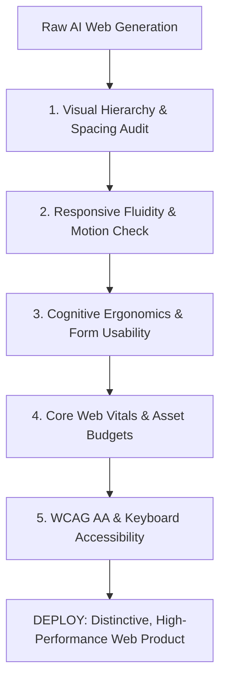

# VIBE CODER'S WEB DESIGN & DEVELOPMENT CANON
## The 50 Authoritative Books on Visual Craft, Modern CSS, Design Systems, UX, Performance, and a11y

> Vibe coding enables rapid full-stack software generation, but uncurated code defaults to **AI Slop**.
> This guide details the 50 foundational texts that give builders the visual taste,
> responsive layout mastery, and cognitive ergonomics to build world-class web products.

---

## Visual Design, UI Aesthetics & Craft

### #1. The Non-Designer's Design Book
- **Author(s)**: Robin Williams
- **Publisher / Edition**: Peachpit Press (2014 (4th Edition))
- **ISBN-10**: `0133966151` | **ISBN-13**: `978-0133966152`
- **Core Premise**: The CRAP principles: Contrast, Repetition, Alignment, Proximity.
- **The Vibe Coder's Edge**: The fastest mental model to audit generated layouts: immediately spots alignment flaws and weak visual contrast.

### #2. The Elements of Typographic Style
- **Author(s)**: Robert Bringhurst
- **Publisher / Edition**: Hartley & Marks (2012 (4th Edition))
- **ISBN-10**: `0881792128` | **ISBN-13**: `978-0881792126`
- **Core Premise**: The typography bible: typographic rhythm, proportion, scale, vertical grid.
- **The Vibe Coder's Edge**: Allows you to instruct AI models with professional typographic vocabulary (leading, tracking, modular scales, measure).

### #3. Universal Principles of Design
- **Author(s)**: William Lidwell, Kritina Holden, Jill Butler
- **Publisher / Edition**: Rockport Publishers (2010 (Revised Edition))
- **ISBN-10**: `1592535879` | **ISBN-13**: `978-1592535873`
- **Core Premise**: 125 foundational design laws (Fitts's Law, Hick's Law, mental models, affordances).
- **The Vibe Coder's Edge**: Invaluable reference to prompt for scientifically validated UI patterns rather than arbitrary aesthetic guesses.

### #4. Thinking with Type
- **Author(s)**: Ellen Lupton
- **Publisher / Edition**: Princeton Architectural Press (2010 (2nd Edition))
- **ISBN-10**: `1568989695` | **ISBN-13**: `978-1568989693`
- **Core Premise**: Practical typography guide: letterforms, grid systems, text hierarchies.
- **The Vibe Coder's Edge**: Elevates web typography from standard font-sans to intentional typographic hierarchy and editorial pacing.

### #5. Grid Systems in Graphic Design
- **Author(s)**: Josef Müller-Brockmann
- **Publisher / Edition**: Niggli Verlag (1996)
- **ISBN-10**: `3721201450` | **ISBN-13**: `978-3721201451`
- **Core Premise**: Swiss International Typographic Style; modular grid layouts and structural discipline.
- **The Vibe Coder's Edge**: Guides multi-column responsive dashboard generation using disciplined mathematical proportions.

### #6. Interaction of Color
- **Author(s)**: Josef Albers
- **Publisher / Edition**: Yale University Press (2013 (50th Anniversary Edition))
- **ISBN-10**: `0300179359` | **ISBN-13**: `978-0300179354`
- **Core Premise**: Color relativity, optical illusions, perceived luminance, palette balance.
- **The Vibe Coder's Edge**: Prevents generating jarring, unreadable color palettes; enables cohesive dark/light mode token systems.

### #7. Design for Hackers: Reverse Engineering Beauty
- **Author(s)**: David Kadavy
- **Publisher / Edition**: Wiley (2011)
- **ISBN-10**: `1119998956` | **ISBN-13**: `978-1119998952`
- **Core Premise**: Deconstructing classical aesthetic proportions (Golden Ratio, Fibonacci) into code logic.
- **The Vibe Coder's Edge**: Helps programmers understand why certain layouts feel harmonious through geometric and historical analysis.

### #8. Layout Essentials: 100 Design Principles for Using Grids
- **Author(s)**: Beth Tondreau
- **Publisher / Edition**: Rockport Publishers (2011)
- **ISBN-10**: `1592537073` | **ISBN-13**: `978-1592537075`
- **Core Premise**: Practical execution of multi-column, modular, and dynamic content layouts.
- **The Vibe Coder's Edge**: Helps break away from standard single-column AI blogs into dynamic magazine-style layouts.

### #9. Microinteractions: Designing with Details
- **Author(s)**: Dan Saffer
- **Publisher / Edition**: O'Reilly Media (2013)
- **ISBN-10**: `144934268X` | **ISBN-13**: `978-1449342685`
- **Core Premise**: Designing feedback loops, triggers, state toggles, and delightful micro-moments.
- **The Vibe Coder's Edge**: Transforms stiff, static AI-generated buttons into tactile, responsive, lively interactive controls.

### #10. Designing Visual Interfaces: Communication Oriented Techniques
- **Author(s)**: Kevin Mullet, Darrell Sano
- **Publisher / Edition**: Prentice Hall (1995)
- **ISBN-10**: `0133033899` | **ISBN-13**: `978-0133033892`
- **Core Premise**: Visual elegance, simplicity, scale, contrast, and visual communication principles.
- **The Vibe Coder's Edge**: Teaches how to prompt for visual restraint, eliminating unnecessary ornamentation and clutter.

## Modern CSS Architecture, Layouts & Motion

### #11. CSS Secrets: Better Solutions to Everyday Web Design Problems
- **Author(s)**: Lea Verou
- **Publisher / Edition**: O'Reilly Media (2015)
- **ISBN-10**: `1449372635` | **ISBN-13**: `978-1449372637`
- **Core Premise**: Advanced CSS techniques: mathematical styling, clip-paths, variable fonts, blend modes.
- **The Vibe Coder's Edge**: Solves tricky visual styling challenges with elegant, modern native CSS rather than heavy JS libraries.

### #12. CSS: The Definitive Guide: Visual Presentation for the Web
- **Author(s)**: Eric A. Meyer, Estelle Weyl
- **Publisher / Edition**: O'Reilly Media (2023 (5th Edition))
- **ISBN-10**: `1098117611` | **ISBN-13**: `978-1098117610`
- **Core Premise**: The complete reference manual for CSS specifications, Flexbox, Grid, and transforms.
- **The Vibe Coder's Edge**: The ultimate technical ground truth when debugging strange layout bugs that LLMs hallucinate fixes for.

### #13. Modern CSS with Tailwind: Flexible Styling Without the Fuss
- **Author(s)**: Noel Rappin
- **Publisher / Edition**: Pragmatic Bookshelf (2021)
- **ISBN-10**: `1680508563` | **ISBN-13**: `978-1680508567`
- **Core Premise**: Utility-first workflows, theme configuration, component extraction, arbitrary values.
- **The Vibe Coder's Edge**: How to structure clean, maintainable utility systems without polluting JSX/HTML into an unreadable mess.

### #14. Transitions and Animations with CSS: Adding Motion to the Web
- **Author(s)**: Estelle Weyl
- **Publisher / Edition**: O'Reilly Media (2013)
- **ISBN-10**: `1449321585` | **ISBN-13**: `978-1449321581`
- **Core Premise**: Hardware-accelerated transforms, timing functions, CSS keyframe choreographies.
- **The Vibe Coder's Edge**: Teaches how to prompt for 60fps GPU-composited animations without triggering layout thrashing.

### #15. Responsive Web Design
- **Author(s)**: Ethan Marcotte
- **Publisher / Edition**: A Book Apart (2011)
- **ISBN-10**: `0983367116` | **ISBN-13**: `978-0983367116`
- **Core Premise**: The foundational text: fluid grids, flexible media, progressive layout adaptation.
- **The Vibe Coder's Edge**: Instills core responsive philosophy: building layouts that flex naturally with content and screen size.

### #16. CSS in Depth
- **Author(s)**: Keith J. Grant
- **Publisher / Edition**: Manning Publications (2018)
- **ISBN-10**: `1617293407` | **ISBN-13**: `978-1617293405`
- **Core Premise**: Deep dive into cascade, specificity, stacking contexts, custom properties, and subgrid.
- **The Vibe Coder's Edge**: Eliminates z-index wars and specificity overrides when combining generated CSS snippets.

### #17. SVG Animations: From Common UX Concerns to Complex Responsive Animation
- **Author(s)**: Sarah Drasner
- **Publisher / Edition**: O'Reilly Media (2017)
- **ISBN-10**: `1491939702` | **ISBN-13**: `978-1491939703`
- **Core Premise**: Vector illustration manipulation, SMIL, CSS animation, GSAP orchestration.
- **The Vibe Coder's Edge**: Teaches how to prompt for lightweight, resolution-independent vector animations that outshine heavy GIF assets.

### #18. Sass and Compass in Action
- **Author(s)**: Wynn Netherland, Nathan Weizenbaum, Chris Eppstein, Brandon Mathis
- **Publisher / Edition**: Manning Publications (2013)
- **ISBN-10**: `1617290149` | **ISBN-13**: `978-1617290145`
- **Core Premise**: Preprocessed stylesheets, mixins, nested selectors, design tokens.
- **The Vibe Coder's Edge**: Foundational understanding of CSS variables and architectural preprocessor patterns.

### #19. CSS Master
- **Author(s)**: Tiffany B. Brown
- **Publisher / Edition**: SitePoint (2021 (3rd Edition))
- **ISBN-10**: `1925836428` | **ISBN-13**: `978-1925836424`
- **Core Premise**: Modern layout techniques, CSS Grid, custom properties, blend modes, filters.
- **The Vibe Coder's Edge**: Practical handbook for cutting-edge CSS features that eliminate legacy JavaScript polyfills.

### #20. Pro CSS3 Animation
- **Author(s)**: Dudley Storey
- **Publisher / Edition**: Apress (2013)
- **ISBN-10**: `1430247258` | **ISBN-13**: `978-1430247258`
- **Core Premise**: Keyframe physics, transition curves, easing functions, 3D CSS transforms.
- **The Vibe Coder's Edge**: Guides prompting for fluid UI feedback loops that make interfaces feel natural and physical.

## Component Systems, Design Systems & Frontend Architecture

### #21. Atomic Design
- **Author(s)**: Brad Frost
- **Publisher / Edition**: Brad Frost (2016)
- **ISBN-10**: `0998296600` | **ISBN-13**: `978-0998296609`
- **Core Premise**: Component hierarchy: Atoms, Molecules, Organisms, Templates, Pages.
- **The Vibe Coder's Edge**: The scaffolding roadmap: guides how you structure agent prompts from basic UI primitives to full templates.

### #22. Designing Interfaces: Patterns for Effective Interaction Design
- **Author(s)**: Jenifer Tidwell, Charles Brewer, Aynne Valencia
- **Publisher / Edition**: O'Reilly Media (2020 (3rd Edition))
- **ISBN-10**: `1492051969` | **ISBN-13**: `978-1492051961`
- **Core Premise**: Catalog of canonical interaction patterns: navigation, search, data presentation.
- **The Vibe Coder's Edge**: Prevents reinventing the wheel: prompts AI for proven, industry-standard UI patterns.

### #23. Design Systems: A Practical Guide to Creating Design Languages for Digital Products
- **Author(s)**: Alla Kholmatova
- **Publisher / Edition**: Smashing Magazine (2017)
- **ISBN-10**: `3945749581` | **ISBN-13**: `978-3945749586`
- **Core Premise**: Shared visual vocabulary, design tokens, purpose-directed pattern libraries.
- **The Vibe Coder's Edge**: Guides establishing a global theme token system before prompting page-level layouts.

### #24. Building Design Systems: Unify User Experiences through a Shared Design Language
- **Author(s)**: Sarrah Vesselov, Taurie Davis
- **Publisher / Edition**: Apress (2019)
- **ISBN-10**: `148424513X` | **ISBN-13**: `978-1484245132`
- **Core Premise**: Cross-functional design system workflows, component governance, documentation.
- **The Vibe Coder's Edge**: Helps maintain stylistic and functional consistency across dozens of AI prompting sessions.

### #25. Frontend Architecture for Design Systems: A Modern Blueprint for Scalable and Sustainable Websites
- **Author(s)**: Micah Godbolt
- **Publisher / Edition**: O'Reilly Media (2016)
- **ISBN-10**: `1491926783` | **ISBN-13**: `978-1491926789`
- **Core Premise**: Component-driven architecture, CSS modularity, asset pipeline integration.
- **The Vibe Coder's Edge**: Teaches how to connect design tokens directly to build tooling and continuous deployment pipelines.

### #26. Micro Frontends in Action
- **Author(s)**: Michael Geers
- **Publisher / Edition**: Manning Publications (2020)
- **ISBN-10**: `1617296872` | **ISBN-13**: `978-1617296871`
- **Core Premise**: Decoupled vertical frontend architectures, independent deployment, routing integration.
- **The Vibe Coder's Edge**: How to partition a massive vibe-coded application into independently promptable, isolated frontend micro-apps.

### #27. Frameworkless Front-End Development: Do You Have a Focus on the Foundation?
- **Author(s)**: Francesco Strazzullo
- **Publisher / Edition**: Apress (2019)
- **ISBN-10**: `1484249666` | **ISBN-13**: `978-1484249666`
- **Core Premise**: Understanding DOM manipulation, routing, and state management without framework lock-in.
- **The Vibe Coder's Edge**: Enables vibe coders to build blazing-fast vanilla JS/TS apps when heavy React/Angular scaffolding is overkill.

### #28. Web Components in Action
- **Author(s)**: Ben Farrell
- **Publisher / Edition**: Manning Publications (2019)
- **ISBN-10**: `1617295779` | **ISBN-13**: `978-1617295775`
- **Core Premise**: Native Custom Elements, Shadow DOM encapsulation, HTML Templates.
- **The Vibe Coder's Edge**: Teaches building framework-agnostic design system components that run anywhere without build steps.

### #29. Developing Large Web Applications: Producing Code That Can Grow and Prosper
- **Author(s)**: Kyle Loudon
- **Publisher / Edition**: O'Reilly Media (2010)
- **ISBN-10**: `0596803028` | **ISBN-13**: `978-0596803025`
- **Core Premise**: Modularity, component reuse, testing strategies, deployment architectures.
- **The Vibe Coder's Edge**: Architectural guidelines to prevent rapid AI code iterations from collapsing into spaghetti.

### #30. Maintainable JavaScript: Writing Readable, Lean, and Reusable Code
- **Author(s)**: Nicholas C. Zakas
- **Publisher / Edition**: O'Reilly Media (2012)
- **ISBN-10**: `1449325246` | **ISBN-13**: `978-1449325244`
- **Core Premise**: Strict code conventions, decoupling application logic from event handlers.
- **The Vibe Coder's Edge**: Provides explicit architectural rules to inject into prompts to ensure clean separation of concerns.

## UX Psychology, Cognitive Ergonomics & Usability

### #31. Don't Make Me Think, Revisited: A Common Sense Approach to Web Usability
- **Author(s)**: Steve Krug
- **Publisher / Edition**: New Riders (2014 (3rd Edition))
- **ISBN-10**: `0321965515` | **ISBN-13**: `978-0321965516`
- **Core Premise**: The usability law: interfaces should be self-evident; eliminate needless user cognitive friction.
- **The Vibe Coder's Edge**: The golden rule: audits vibe-coded UIs to ensure every screen requires zero cognitive effort to navigate.

### #32. The Design of Everyday Things
- **Author(s)**: Don Norman
- **Publisher / Edition**: Basic Books (2013 (Revised Edition))
- **ISBN-10**: `0465050654` | **ISBN-13**: `978-0465050659`
- **Core Premise**: Affordances, signifiers, constraints, feedback, mapping, conceptual models.
- **The Vibe Coder's Edge**: Identifies why users misclick generated UI elements: reveals missing signifiers and mismatched mental models.

### #33. Designing with the Mind in Mind: Simple Guide to Understanding User Interface Design Guidelines
- **Author(s)**: Jeff Johnson
- **Publisher / Edition**: Morgan Kaufmann (2020 (3rd Edition))
- **ISBN-10**: `0128182024` | **ISBN-13**: `978-0128182024`
- **Core Premise**: Cognitive psychology principles: visual perception, peripheral vision, working memory limits.
- **The Vibe Coder's Edge**: Explains the biological reasons behind UI rules (e.g. why users ignore banners, how chunking aids form completion).

### #34. About Face: The Essentials of Interaction Design
- **Author(s)**: Alan Cooper, Robert Reimann, David Cronin, Christopher Noessel
- **Publisher / Edition**: Wiley (2014 (4th Edition))
- **ISBN-10**: `1118766571` | **ISBN-13**: `978-1118766576`
- **Core Premise**: Goal-directed design, interaction idioms, avoiding mechanical sympathy.
- **The Vibe Coder's Edge**: Eliminates developer-centric UI; forces generated interfaces to align with actual user workflow goals.

### #35. Rocket Surgery Made Easy: The Do-It-Yourself Guide to Finding and Fixing Usability Problems
- **Author(s)**: Steve Krug
- **Publisher / Edition**: New Riders (2009)
- **ISBN-10**: `0321657292` | **ISBN-13**: `978-0321657299`
- **Core Premise**: Do-it-yourself usability testing: 3 users, 1 morning a month, fix the biggest problems.
- **The Vibe Coder's Edge**: Enables rapid usability testing loops on vibe-coded MVPs to detect confusion points in under 30 minutes.

### #36. 100 Things Every Designer Needs to Know About People
- **Author(s)**: Susan Weinschenk
- **Publisher / Edition**: New Riders (2020 (2nd Edition))
- **ISBN-10**: `0136746918` | **ISBN-13**: `978-0136746911`
- **Core Premise**: Behavioral science and neuro-design: attention capture, decision fatigue, motivation.
- **The Vibe Coder's Edge**: Shows how to structure onboarding and dashboard landing screens to maximize user engagement and retention.

### #37. Emotional Design: Why We Love (or Hate) Everyday Things
- **Author(s)**: Don Norman
- **Publisher / Edition**: Basic Books (2005)
- **ISBN-10**: `0465051367` | **ISBN-13**: `978-0465051366`
- **Core Premise**: Visceral, behavioral, and reflective design levels.
- **The Vibe Coder's Edge**: Teaches how to infuse vibe-coded tools with reflective delight and emotional resonance that competitors cannot copy.

### #38. Seductive Interaction Design: Creating Playful, Fun, and Effective User Experiences
- **Author(s)**: Stephen P. Anderson
- **Publisher / Edition**: New Riders (2011)
- **ISBN-10**: `0321725522` | **ISBN-13**: `978-0321725523`
- **Core Premise**: Playful interactions, curating curiosity, subtle psychological nudges.
- **The Vibe Coder's Edge**: Transforms boring administrative forms into engaging, interactive onboarding flows.

### #39. Hooked: How to Build Habit-Forming Products
- **Author(s)**: Nir Eyal
- **Publisher / Edition**: Portfolio (2014)
- **ISBN-10**: `1591847788` | **ISBN-13**: `978-1591847786`
- **Core Premise**: The Hook Loop: Trigger, Action, Variable Reward, Investment.
- **The Vibe Coder's Edge**: Designs core retention loops into web apps so users return organically without expensive re-marketing.

### #40. The Mom Test: How to Talk to Customers & Learn If Your Business is a Good Idea
- **Author(s)**: Rob Fitzpatrick
- **Publisher / Edition**: Founder Craft (2013)
- **ISBN-10**: `1492180742` | **ISBN-13**: `978-1492180746`
- **Core Premise**: How to talk to customers and uncover true pain points without leading them to lie.
- **The Vibe Coder's Edge**: Mandatory before vibe-coding: validates that the UX addresses real problems rather than imagined needs.

## Web Performance, Core Web Vitals & Browser Networking

### #41. High Performance Web Sites: Essential Knowledge for Front-End Engineers
- **Author(s)**: Steve Souders
- **Publisher / Edition**: O'Reilly Media (2007)
- **ISBN-10**: `0596529309` | **ISBN-13**: `978-0596529307`
- **Core Premise**: The original 14 frontend performance rules: minification, caching, script placement.
- **The Vibe Coder's Edge**: The baseline performance checklist to inject into build prompts and asset delivery configs.

### #42. Even Faster Web Sites: Performance Best Practices for Web Developers
- **Author(s)**: Steve Souders
- **Publisher / Edition**: O'Reilly Media (2009)
- **ISBN-10**: `0596522304` | **ISBN-13**: `978-0596522308`
- **Core Premise**: Splitting code, non-blocking asynchronous script loading, domain sharding.
- **The Vibe Coder's Edge**: Teaches how to prompt for non-blocking asynchronous asset loading that keeps the main thread responsive.

### #43. Designing for Performance: Weighing Aesthetics and Speed
- **Author(s)**: Lara Callender Hogan
- **Publisher / Edition**: O'Reilly Media (2014)
- **ISBN-10**: `1491902515` | **ISBN-13**: `978-1491902516`
- **Core Premise**: Performance budgets, aligning design aesthetics with page speed, user perception.
- **The Vibe Coder's Edge**: Helps set strict byte budgets on vibe-coded apps before adding heavy client-side dependencies.

### #44. Web Performance in Action: Building Fast Web Pages
- **Author(s)**: Jeremy L. Wagner
- **Publisher / Edition**: Manning Publications (2016)
- **ISBN-10**: `1617293776` | **ISBN-13**: `978-1617293771`
- **Core Premise**: Critical rendering path, image compression, HTTP/2 multiplexing, service workers.
- **The Vibe Coder's Edge**: Hands-on recipes to score 95+ on Google Lighthouse by optimizing CSS delivery and image formats.

### #45. High Performance Browser Networking: What Every Web Developer Should Know About Networking and Web Performance
- **Author(s)**: Ilya Grigorik
- **Publisher / Edition**: O'Reilly Media (2013)
- **ISBN-10**: `1449344763` | **ISBN-13**: `978-1449344764`
- **Core Premise**: TCP/UDP mechanics, TLS handshakes, HTTP/2/3, WebSockets, WebRTC optimization.
- **The Vibe Coder's Edge**: The definitive guide to browser network plumbing: debugs latency, keep-alives, and connection pooling.

### #46. Time Is Money: The Business Value of Web Performance
- **Author(s)**: Tammy Everts
- **Publisher / Edition**: O'Reilly Media (2016)
- **ISBN-10**: `1491935413` | **ISBN-13**: `978-1491935415`
- **Core Premise**: Connecting milliseconds of latency to user bounce rates, conversion rates, and revenue.
- **The Vibe Coder's Edge**: Provides empirical justification to resist bloating vibe-coded interfaces with unnecessary third-party scripts.

## Accessibility (a11y), Forms & Web Standards

### #47. Inclusive Design Patterns: Coding Accessibility Into Web Components
- **Author(s)**: Heydon Pickering
- **Publisher / Edition**: Smashing Magazine (2016)
- **ISBN-10**: `3945749433` | **ISBN-13**: `978-3945749432`
- **Core Premise**: Accessible component patterns: tab controls, toggle buttons, modal dialogs, data tables.
- **The Vibe Coder's Edge**: The a11y gold standard: teaches how to prompt for semantic, accessible ARIA roles and keyboard interactions.

### #48. Form Design Patterns: A Practical Guide to Designing and Building Forms for the Web
- **Author(s)**: Adam Silver
- **Publisher / Edition**: Smashing Magazine (2018)
- **ISBN-10**: `3945749719` | **ISBN-13**: `978-3945749715`
- **Core Premise**: Bulletproof web forms: validation errors, input masks, multi-step flows, error recovery.
- **The Vibe Coder's Edge**: Ensures forms never fail users: prompts for accessible inline errors, clear labels, and graceful validation.

### #49. Accessibility for Everyone
- **Author(s)**: Laura Kalbag
- **Publisher / Edition**: A Book Apart (2017)
- **ISBN-10**: `1937557618` | **ISBN-13**: `978-1937557614`
- **Core Premise**: Pragmatic WCAG guidelines, color contrast, keyboard traps, inclusive user research.
- **The Vibe Coder's Edge**: Eliminates inaccessible gray-on-gray text, unannounced modal states, and broken tab orders in AI code.

### #50. HTML5 for Web Designers
- **Author(s)**: Jeremy Keith, Rachel Andrew
- **Publisher / Edition**: A Book Apart (2016 (2nd Edition))
- **ISBN-10**: `1937557456` | **ISBN-13**: `978-1937557454`
- **Core Premise**: Native semantic elements (<main>, <article>, <dialog>), document outlines.
- **The Vibe Coder's Edge**: Stops the AI habit of building div-soup; enforces semantic HTML that screen readers understand out of the box.

---
## The Vibe Coder's Visual Quality Refinement Matrix

